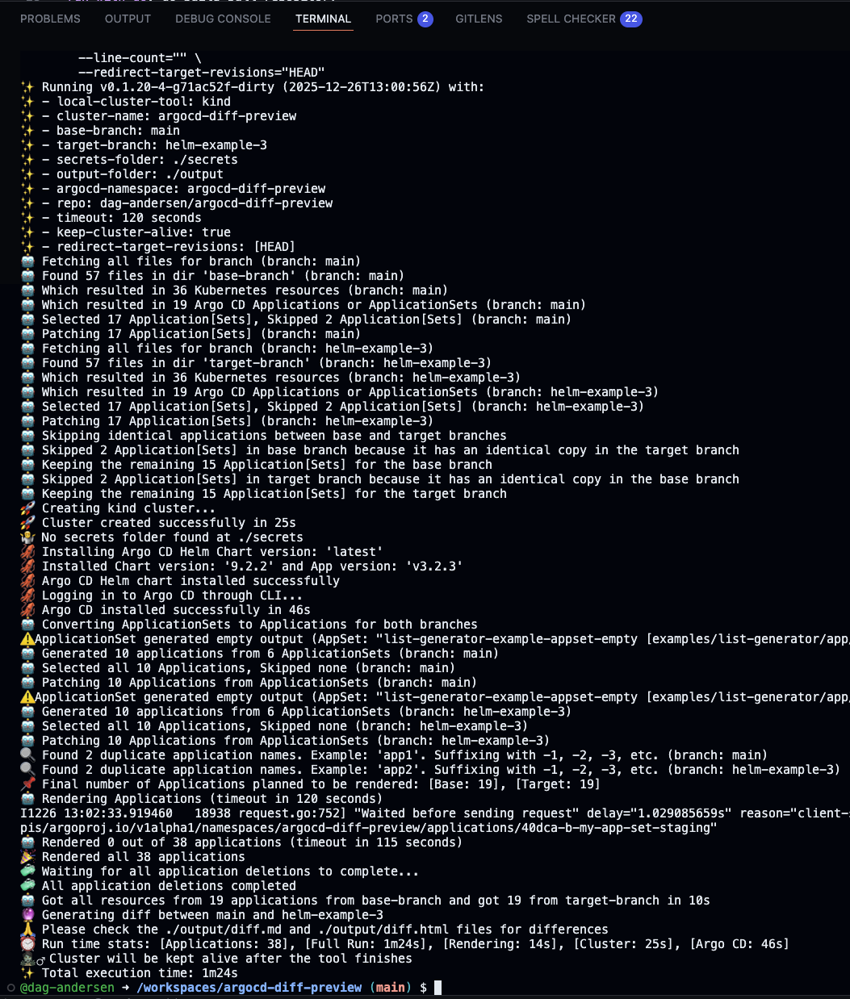
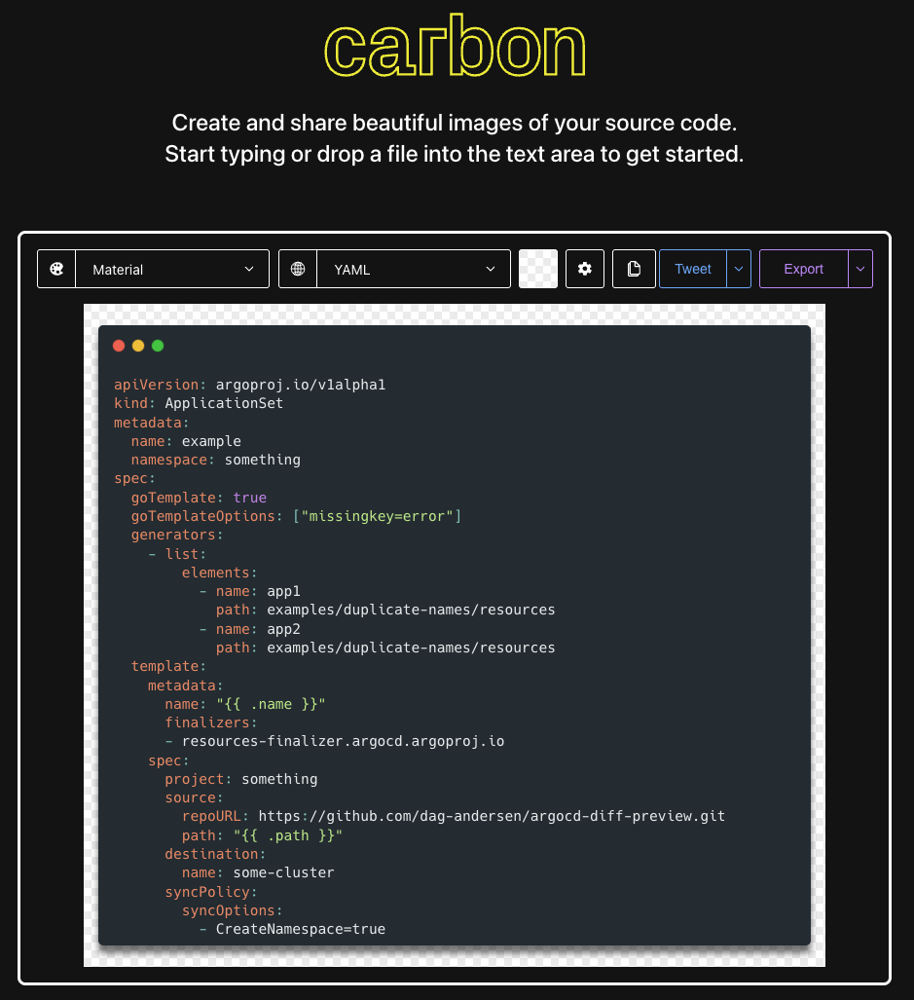
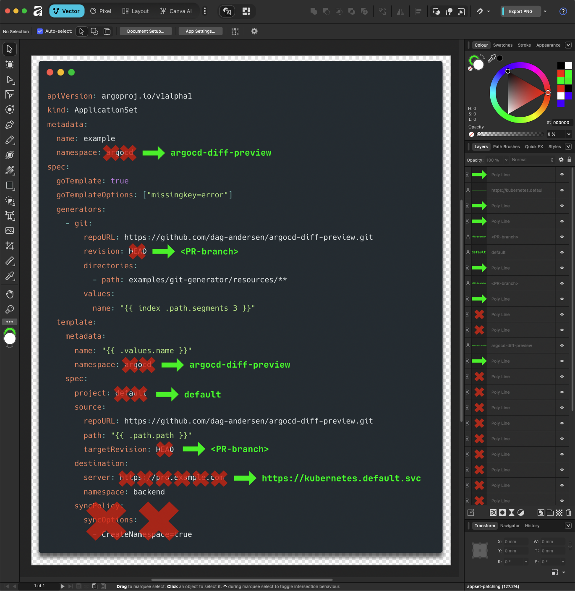

# Contributing to ArgoCD Diff Preview

Thank you for your interest in contributing to ArgoCD Diff Preview! This document provides guidelines and instructions for contributing to the project.

## GitHub Codespaces (Simplest way to get started)

1. Open the repository in GitHub Codespaces:

<p align="center">
  
</p>

2. Verify the setup works:

```bash
make run-with-go target_branch=helm-example-3
```

Output should look similar to like this:

<!-- screenshot of the output of the above command -->
<p align="center">
  
</p>

> [!IMPORTANT]
> If you experience issues with the setup, please open an issue in the repository! 🚀

## Local Development Environment Setup

### Prerequisites

**Required:**
- **Go** (1.21+)
- **Docker**
- **Git**
- **Make**

**Required only when running with Go** (not needed for Docker):
- [kind](https://kind.sigs.k8s.io/)
- [kubectl](https://kubernetes.io/docs/reference/kubectl/)
- [Helm](https://helm.sh/)
- [Argo CD CLI](https://argo-cd.readthedocs.io/en/stable/cli_installation/)

### Setup

1. Clone the repository:
   ```bash
   git clone https://github.com/dag-andersen/argocd-diff-preview.git
   cd argocd-diff-preview
   ```

2. Install Go dependencies:
   ```bash
   go mod download
   ```

3. (Optional) Setup for documentation development:
   ```bash
   python3 -m venv venv
   source venv/bin/activate
   pip3 install mkdocs-material
   ```

## Project Structure

```
argocd-diff-preview/
├── cmd/                  # Main application entry points
├── pkg/                  # Core application logic
├── tests/                # Integration tests
├── docs/                 # Documentation
├── argocd-config/        # Argo CD configuraiton that is installed with Argo CD
└── examples/             # Examples used by the integration tests and pull request examples
```

## Building the tool

### Building the tool with Go

```bash
make go-build
```

This will create a binary in the `bin/` directory.

### Building the tool with Docker

```bash
make docker-build
```

## Running the tool locally

There are two ways to run the tool locally:

### Using branches from the ArgoCD Diff Preview repository

```bash
make run-with-go target_branch=<your-branch-name>
```
or 
```bash
make run-with-docker target_branch=<your-branch-name>
```

_example to make sure the tool works run:_
```bash
make run-with-go target_branch=helm-example-3
```

### Using branches from your own fork

```bash
make run-with-go target_branch=<your-branch-name> github_org=<your-username>
```

```bash
make run-with-docker target_branch=<your-branch-name> github_org=<your-username>
```

## Testing

ArgoCD Diff Preview uses integration tests to verify functionality. These tests create ephemeral Kubernetes clusters and test the application against various test scenarios.

### Running All Integration Tests

Using Go:
```bash
make run-integration-tests-go
```

Using Docker:
```bash
make run-integration-tests-docker
```

If you have made changes to the output of the tool, you can update the expected output for integration tests by setting the `update_expected` variable to `true`. Example:

```bash
make run-integration-tests-docker update_expected=true
```

This will update the updated output files in the `tests/integration-test/` directory.

### Running Unit Tests

To run all unit tests in the project:

```bash
make run-unit-tests
```

> [!TIP]
> Before you create a pull request, please run `make check-release` to verify that the tool works as expected. Feel free to reach out if you need help! 🚀

## Documentation

The project uses MkDocs for documentation. To serve the documentation locally:

```bash
make mkdocs
```

This will open the documentation in your default browser.

### Illustrations

For most documentation, standard markdown code blocks are sufficient:

~~~markdown
```yaml
apiVersion: v1
kind: ConfigMap
```
~~~

Only use the tools below when a plain code block isn't enough - for example, when you need to create a diagram explaining a concept.

| Tool | Use case |
|------|----------|
| [Carbon](https://carbon.now.sh) | When you need a code block as an png |
| [Affinity](https://www.affinity.studio/) | Any illustration/diagram where a code block isn't enough |

#### Code (Carbon)

When you need an illustration including a code snippet. E.g., when you want to draw on top of a code block.

1. Open [Carbon](https://carbon.now.sh)
2. Import settings from [`docs/assets/carbon-config.json`](/docs/assets/carbon-config.json)
3. Export as PNG

<p align="center">
  
</p>

#### Advanced Illustrations

For any visual that can't be expressed as a code block, we use _Affinity_.

**File conventions:**

- Store both source (`.af`) and export (`.png`) in `docs/assets/`
- Name them identically: `appset-patching.af` → `appset-patching.png`
- One illustration per file

> **Why not use draw.io or similar?** Tools made with tools like draw.io tend to look ugly, and they are overall less powerful.

<p align="center">
  
</p>

## License

By contributing to ArgoCD Diff Preview, you agree that your contributions will be licensed under the project's license (refer to the LICENSE file in the repository).
