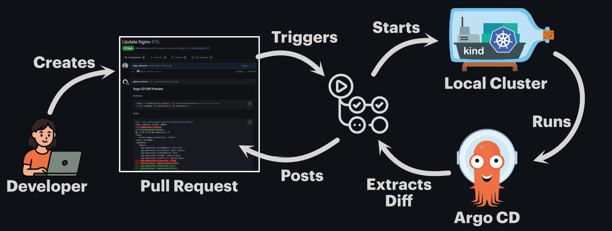

<p align="center">
  
</p>

Argo CD Diff Preview is a tool that renders the diff between two branches in a Git repository. It is designed to render manifests generated by Argo CD, providing a clear and concise view of the changes between two branches. It operates similarly to Atlantis for Terraform, creating a plan that outlines the proposed changes.

### 3 Example Pull Requests:
- [Helm Example | Internal Chart](https://github.com/dag-andersen/argocd-diff-preview/pull/16)
- [Helm example | External Chart: Nginx](https://github.com/dag-andersen/argocd-diff-preview/pull/15)
- [Kustomize Example](https://github.com/dag-andersen/argocd-diff-preview/pull/12)


## Why do we need this?

In the Kubernetes world, we often use templating tools like Kustomize and Helm to generate our Kubernetes manifests. These tools make maintaining and streamlining configuration easier across applications and environments. However, they also make it harder to visualize the application's actual configuration in the cluster.

Mentally parsing Helm templates and Kustomize patches is hard without rendering the actual output. Thus, making mistakes while modifying an application's configuration is relatively easy.

In the field of GitOps and infrastructure as code, all configurations are checked into Git and modified through PRs. The code changes in the PR are reviewed by a human, who needs to understand the changes made to the configuration. This is hard when the configuration is generated through templating tools like Kustomize and Helm.

## Overview

### Using ephemeral clusters



### Using pre-configured clusters


The safest way to make changes to you Helm Charts and Kustomize Overlays in your GitOps repository is to let Argo CD render them for you. This can be done by spinning up an ephemeral cluster (or connecting to a pre-configured cluster) in your automated pipelines. Since the diff is rendered by Argo CD itself, it is as accurate as possible.

Check out [How it works](https://dag-andersen.github.io/argocd-diff-preview/how-it-works/)

## Features

- **Accurate diffs** - Renders manifests using Argo CD itself, so the diff is as accurate as possible
- **Complete isolation** - Run with ephemeral clusters - no access to your real cluster or Argo CD instance required
- **Connect to pre-installed Argo CD** - Skip cluster creation for faster execution (~60-90s saved)
- **Run locally** - Test changes before opening a pull request
- **Private repos & charts** - Works with private Git repositories and Helm charts
- **Multi-source applications** - Full support for Argo CD multi-source apps
- **ApplicationSets** - Supports List, Git, Matrix, Merge, and other generators
- **Config Management Plugins** - Use custom CMPs via Argo CD Helm chart configuration
- **External chart visibility** - See exactly what changed when updating a Helm chart version (e.g., Nginx). [PR example](https://github.com/dag-andersen/argocd-diff-preview/pull/15)
- **Smart filtering** - Filter applications by file path, regex, labels, or change detection.
- **Diff noise filtering** - Ignore version bumps, generated values, or other noisy changes with `--diff-ignore`
- **Multiple output formats** - Generates Markdown (for PR comments), HTML, and full YAML manifests
- **Dry run mode** - Preview which applications would be rendered without creating a cluster

---

> [!TIP]
> 
> ## Try demo locally with 3 simple commands!
> 
> First, make sure Docker is running. E.g., run `docker ps` to see if it's running.
> 
> Second, run the following 3 commands:
> 
> ```bash
> git clone https://github.com/dag-andersen/argocd-diff-preview base-branch --depth 1 -q 
> git clone https://github.com/dag-andersen/argocd-diff-preview target-branch --depth 1 -q -b helm-example-3
> docker run \
>    --network host \
>    -v /var/run/docker.sock:/var/run/docker.sock \
>    -v $(pwd)/output:/output \
>    -v $(pwd)/base-branch:/base-branch \
>    -v $(pwd)/target-branch:/target-branch \
>    -e TARGET_BRANCH=helm-example-3 \
>    -e REPO=dag-andersen/argocd-diff-preview \
>    dagandersen/argocd-diff-preview:v0.1.22
> ```
> 
> and the output would be something like this:
> 
> ```
> ...
> 🚀 Creating cluster...
> 🦑 Installing Argo CD...
> ...
> 🌚 Getting resources for base-branch
> 🌚 Getting resources for target-branch
> ...
> 🔮 Generating diff between main and helm-example-3
> 🙏 Please check the ./output/diff.md file for differences
> ```
> 
> Finally, you can view the diff by running `cat ./output/diff.md`. The diff should look something like [this](https://github.com/dag-andersen/argocd-diff-preview/pull/16)

## Basic usage in a GitHub Actions Workflow

The most basic example of how to use `argocd-diff-preview` in a GitHub Actions workflow is shown below. In this example, the tool will run on every pull request to the `main` branch, and the diff will be posted as a comment on the pull request.

This example works only if your Git repository is public and you are using public Helm Charts. If you have a private repository or are using private Helm Charts, you need to provide the tool with the necessary credentials. Refer to the [full documentation](https://dag-andersen.github.io/argocd-diff-preview/getting-started/github-actions-workflow#private-repositories-and-helm-charts) to learn how to do this.

```yaml
# .github/workflows/generate-diff.yml
name: Argo CD Diff Preview

on:
  pull_request:
    branches:
      - main

jobs:
  build:
    runs-on: ubuntu-latest
    permissions:
      contents: read
      pull-requests: write

    steps:
      - uses: actions/checkout@v4
        with:
          path: pull-request

      - uses: actions/checkout@v4
        with:
          ref: main
          path: main

      - name: Generate Diff
        run: |
          docker run \
            --network=host \
            -v /var/run/docker.sock:/var/run/docker.sock \
            -v $(pwd)/main:/base-branch \
            -v $(pwd)/pull-request:/target-branch \
            -v $(pwd)/output:/output \
            -e TARGET_BRANCH=refs/pull/${{ github.event.number }}/merge \
            -e REPO=${{ github.repository }} \
            dagandersen/argocd-diff-preview:v0.1.22

      - name: Post diff as comment
        run: |
          gh pr comment ${{ github.event.number }} --repo ${{ github.repository }} --body-file output/diff.md --edit-last || \
          gh pr comment ${{ github.event.number }} --repo ${{ github.repository }} --body-file output/diff.md
        env:
          GITHUB_TOKEN: ${{ secrets.GITHUB_TOKEN }}
```

### Helm/Kustomize generated ArgoCD applications
`argocd-diff-preview` will only look for YAML files in the repository with `kind: Application` or `kind: ApplicationSet`. If your applications are generated from a Helm chart or Kustomize template, you will have to add a step in the pipeline that renders the chart/template. Refer to the [full documentation](https://dag-andersen.github.io/argocd-diff-preview/generated-applications/) to learn how to do this.

### Other VCS Providers

If you’re using GitLab, Bitbucket, Jenkins, CircleCI, or any other tool – it should still work. However, there might not be documentation available for it, since everything beyond the GitHub docs is community-contributed. If you get it working with a tool that isn’t mentioned in the documentation, we’d really appreciate it if you shared your setup with the community ❤️

### Speed up the rendering process

Instead of spinning up an ephemeral cluster for each diff preview, you can connect to a cluster with Argo CD pre-installed. This saves approximately `60` seconds per run. Refer to the [documentation](https://dag-andersen.github.io/argocd-diff-preview/reusing-clusters/connecting/) to learn how to do this.

Rendering manifests for all applications in your repository on every pull request can be time-consuming, especially in large monorepos. By default, `argocd-diff-preview` renders all applications it finds, but you can significantly speed up the process by limiting which applications are rendered. Refer to the [Application Selection](https://dag-andersen.github.io/argocd-diff-preview/application-selection/) section in the docs to learn how to do this.

### Compare against live Argo CD

If you want to compare the pull request output against the live state of a remote Argo CD instance, enable live comparison mode:

```bash
argocd-diff-preview \
  --compare-live \
  --live-argocd-url https://argocd.example.com \
  --live-argocd-token "$ARGOCD_READ_TOKEN" \
  --target-branch feature \
  --repo my-org/my-repo
```

If the Argo CD server uses a self-signed certificate, add `--live-argocd-insecure` to skip TLS verification.

## Full Documentation

[Link to docs](https://dag-andersen.github.io/argocd-diff-preview/)

## Blog Posts

- [Rendering the TRUE Argo CD diff on your PRs](https://dev.to/dag-andersen/rendering-the-true-argo-cd-diff-on-your-prs-10bk)
- [Argo CD: Previewing Pull Request changes in SECONDS! 🥵⚡️⏰](https://dev.to/dag-andersen/argo-cd-previewing-pull-requests-changes-in-seconds-241g)

## Talks

### ArgoCon NA 2024

 `argocd-diff-preview` was presented at ArgoCon 2024 in Salt Lake City, US. The talk covered current tools and methods for visualizing code changes in GitOps workflows and introduced a new approach using ephemeral clusters to render accurate diffs directly on pull requests.

- Talk description: [GitOps Safety: Rendering Accurate ArgoCD Diffs Directly on Pull Requests](https://colocatedeventsna2024.sched.com/event/1izsL/gitops-safety-rendering-accurate-argocd-diffs-directly-on-pull-requests-dag-bjerre-andersen-visma-regina-voloshin-octopus-deploy)
- Talk recording: [YouTube](https://youtu.be/3aeP__qPSms)

### ArgoCon EU 2026

`argocd-diff-preview` will be presented at ArgoCon EU 2026 in Amsterdam, The Netherlands. This talk shows how you can reduce preview times from minutes to seconds by connecting to a pre-configured Argo CD instance instead of spinning up ephemeral clusters. Includes real-world examples from [Egmont](https://www.egmont.com/) and [TangoMe](https://www.tango.me/).

- Talk description: [Argo CD: Previewing Pull Request Changes in SECONDS!](https://colocatedeventseu2026.sched.com/event/2DY8T/argo-cd-previewing-pull-request-changes-in-seconds-dag-bjerre-andersen-egmont-sergey-shevchenko-tangome)

## All Contributors

<a href="https://github.com/dag-andersen/argocd-diff-preview/graphs/contributors">
  
</a>

## Contributing

We welcome contributions to ArgoCD Diff Preview! Whether it's bug fixes, feature additions, or documentation improvements.

Please check out our [contribution guidelines](CONTRIBUTING.md) for details on how to set up your development environment, run tests, and submit changes.

## Questions, issues, or suggestions
If you experience issues or have any questions or suggestions, please open an issue in this repository! 🚀
