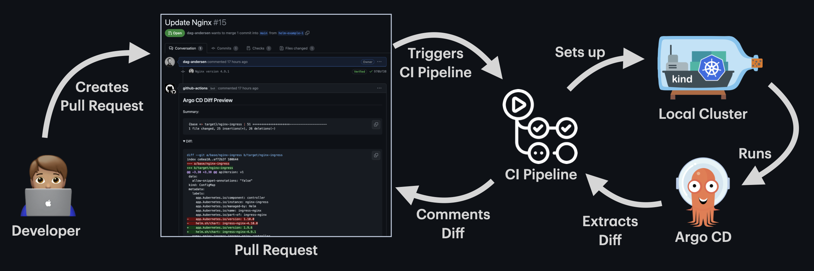
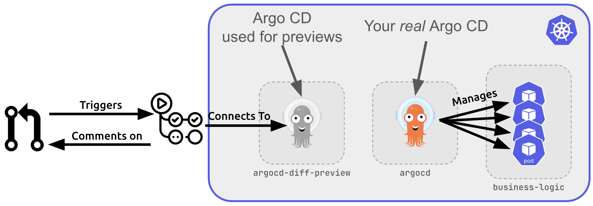
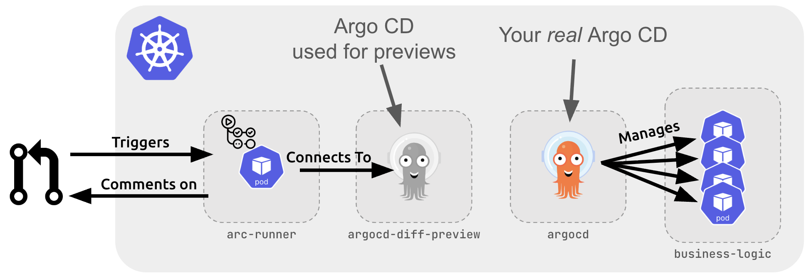

# Previewing Argo CD Applications on Pull Requests in seconds


> TLDR; You can now render previews of changes in a PR using an existing cluster instead of spinning up a new one each run. This results in a very short preview time while still being very accurate.

This is a continuation of the first blog post: [Rendering the TRUE Argo CD diff on your PRs](https://dev.to/dag-andersen/rendering-the-true-argo-cd-diff-on-your-prs-10bk). That article addresses a critical challenge in GitOps workflows: visualizing the actual impact of configuration changes when using templating tools like Helm and Kustomize.

The original approach involves spinning up ephemeral Kubernetes clusters inside your CI/CD pipeline to let Argo CD itself render the manifests. This ensures maximum accuracy since the same engine that will deploy your changes is the one generating the preview.



**Why is this approach superior to alternatives?**

- **True accuracy**: Unlike tools that try to mimic Argo CD's rendering logic, this method uses Argo CD itself
- **No infrastructure access required**: Works without needing credentials to your production Argo CD instance

However, this approach has one significant limitation: **Speed**. Creating a cluster and installing Argo CD takes around 60-90 seconds every time, making single application renders take 80+ seconds total.

## Speed: The Bottleneck and the Solution

The ephemeral cluster approach, while highly accurate, comes with an inherent performance cost. Every single preview requires:
- Creating a fresh Kubernetes cluster
- Installing Argo CD from scratch  
- Waiting for all components to become ready

This overhead adds 60-90 seconds to every run, regardless of how simple your configuration changes might be.

**The solution is simple: reuse an existing cluster.**

Instead of creating a new cluster each time, `argocd-diff-preview` can now connect to a pre-existing cluster with Argo CD already installed. This eliminates the cluster creation overhead entirely, reducing preview times from minutes to seconds to just seconds.

**What's changed:**
- **Same accuracy**: The tool still uses Argo CD itself to render manifests, ensuring identical results to your production environment
- **Faster execution**: Skip the 60-90 second cluster creation penalty
- **Simple setup**: Just provide a KubeConfig file (or service account credentials) to access your existing cluster

The rendering logic remains identical to the original approach—the only difference is where Argo CD runs.

### Concurrent Runs: Multiple PRs, No Conflicts

When using an existing cluster, multiple developers can run previews simultaneously without interfering with each other. Here's how it works:

**The Process:**
1. `argocd-diff-preview` scans both branches (base and target) for Argo CD Applications and ApplicationSets
2. Temporarily creates these applications with unique identifiers and applies them to the cluster
3. Extracts the rendered manifests from Argo CD
4. Cleans up by deleting the temporary applications
5. Generates the diff between the two sets of rendered manifests

This means that if you look at the Argo CD UI you will see Applications being created and deleted after a few seconds when you run a preview.
Each preview run gets a unique identifier, ensuring zero naming collisions. Multiple PRs can run previews simultaneously without conflicts.

**Performance Benefits of Parallel Runs:**
Running multiple previews concurrently can actually *improve* performance. When several runs reference the same Git repositories or Helm charts, Argo CD caches these resources, making subsequent renders faster for everyone.

### Use a Dedicated Argo CD Instance

**Important:** It is not recommended to use your production Argo CD instance for previews. Since `argocd-diff-preview` temporarily creates and deletes applications during the rendering process, this could interfere with your live applications and confuse your operations team.

**Recommended Setup:**
Install a dedicated Argo CD instance specifically for diff previews. This instance should:
- Run alongside (but separate from) your production Argo CD
- **Never sync applications** to your actual infrastructure
- Serve purely as a rendering engine for manifest generation
- Have access to the same repositories and Helm registries as your production instance



**Requirements for the dedicated instance:**
- The default `admin` user must not be disabled
- The `default` Argo CD project must exist  
- Required secrets for authentication (Git, Helm registries) must be configured
- No internet exposure needed—`argocd-diff-preview` connects via KubeConfig

**Trade-offs to Consider:**

✅ **Benefits:**
- 60-90 seconds faster per preview
- Same accuracy as ephemeral clusters
- Supports concurrent runs with unique identifiers

❌ **Drawbacks:**
- Requires infrastructure setup and maintenance
- Need to provide cluster credentials to CI/CD pipeline (Breaks the original "no infrastructure access required" benefit)
- Some organizations may consider credential sharing a security risk

#### Demo

**_Step 1_: Create cluster (skip if you already have a cluster with Argo CD installed)**
```bash
kind create cluster --name existing-cluster
helm repo add argo https://argoproj.github.io/argo-helm
helm install argo-cd argo/argo-cd --version 8.0.3
```

**_Step 2_: Clone the base and target branches**
```bash
# Clone the base branch into a subfolder called `base-branch`
git clone https://github.com/dag-andersen/argocd-diff-preview base-branch --depth 1 -q 

# Clone the target branch into a subfolder called `target-branch`
git clone https://github.com/dag-andersen/argocd-diff-preview target-branch --depth 1 -q -b helm-example-3
```

**_Step 3_: Run the tool**

Make sure you:
- Mount the KubeConfig to the container (`-v ~/.kube:/root/.kube`)
- Disable cluster creation (`--create-cluster=false`)
- Specify the Argo CD namespace (`--argocd-namespace=<ns>`)

```bash
docker run \
  --network host \
  -v ~/.kube:/root/.kube \
  -v /var/run/docker.sock:/var/run/docker.sock \
  -v $(pwd)/output:/output \
  -v $(pwd)/base-branch:/base-branch \
  -v $(pwd)/target-branch:/target-branch \
  -e TARGET_BRANCH=helm-example-3 \
  -e REPO=dag-andersen/argocd-diff-preview \
  dagandersen/argocd-diff-preview:v0.1.17 \
  --argocd-namespace=default \
  --create-cluster=false
```

And then the output will look something like this:

```
✨ Running with:
✨ - reusing existing cluster
✨ - base-branch: main
✨ - target-branch: helm-example-3
✨ - output-folder: ./output
✨ - argocd-namespace: default
✨ - repo: dag-andersen/argocd-diff-preview
✨ - timeout: 180 seconds
🔑 Unique ID for this run: 60993
🤖 Fetching all files for branch (branch: main)
🤖 Found 52 files in dir base-branch (branch: main)
...
🤖 Fetching all files for branch (branch: helm-example-3)
🤖 Found 52 files in dir target-branch (branch: helm-example-3)
...
🦑 Logging in to Argo CD through CLI...
🦑 Logged in to Argo CD successfully
🤖 Converting ApplicationSets to Applications in both branches
...
🤖 Patching 19 Applications (branch: main)
🤖 Patching 19 Applications (branch: helm-example-3)
🤖 Rendered 11 out of 38 applications (timeout in 175 seconds)
🧼 Waiting for all application deletions to complete...
🧼 All application deletions completed
🤖 Got all resources from 19 applications from base-branch and got 19 from target-branch in 7s
🔮 Generating diff between main and helm-example-3
🙏 Please check the ./output/diff.md file for differences
✨ Total execution time: 10s
```

More information about the existing cluster can be found in the [existing-cluster](./existing-cluster.md) documentation.

### Alternative: Use a Self-Hosted Runner

For organizations concerned about sharing cluster credentials with their CI/CD pipeline, self-hosted GitHub Actions runners offer an elegant solution.

**How it works:**
Instead of providing credentials to GitHub Actions, you run the pipeline from inside the same cluster as your dedicated Argo CD instance. This approach:

- **Eliminates credential sharing**: No need to store KubeConfig or service account tokens in GitHub secrets
- **Maintains security**: The runner accesses cluster resources directly through its service account
- **Preserves speed**: Still uses the existing cluster approach (no ephemeral cluster creation)



**The Process:**
1. Install Action Runner Controller (ARC) in your cluster alongside the dedicated Argo CD instance
2. The self-hosted runner can directly access Argo CD secrets using `kubectl get secrets -n argocd`
3. These secrets are automatically passed to `argocd-diff-preview` for authentication with Git repositories and Helm registries
4. The tool runs exactly as before, but without any credential management complexity

**Key Benefits:**
- **Enhanced security**: No credentials leave your infrastructure
- **Same performance**: 60-90 seconds faster than ephemeral clusters
- **Simplified setup**: No credential rotation or secret management in CI/CD
- **Network isolation**: Runner operates within your cluster's security boundaries

**Considerations:**
- Requires setting up and maintaining Action Runner Controller

#### How do i set this up?


#### Demo with self-hosted runner

**_Step 1_: Create cluster (skip if you already have a cluster with Argo CD installed)**
```bash
kind create cluster --name existing-cluster
helm repo add argo https://argoproj.github.io/argo-helm
helm install argo-cd argo/argo-cd --version 8.0.3
```

**_Step 2_: Install Action Runner Controller (ARC)**

`helm install arc arc-systems/gha-runner-scale-set-controller --version 0.12.1 --namespace arc-systems --create-namespace`
`helm install arc-runner-set arc-runners/gha-runner-scale-set --version 0.12.1 --namespace arc-runners --create-namespace -f arc-runner-set.yaml`

```yaml
# arc-runner-set.yaml
githubConfigUrl: "https://github.com/<org>/<repo>"
githubConfigSecret: arc-runner-auth

controllerServiceAccount:
  name: arc-gha-rs-controller
  namespace: arc-systems

runnerScaleSetName: arc-runner-test

template:
  spec:
    serviceAccountName: arc-runner
    automountServiceAccountToken: true
```

Where `arc-runner-auth` looks something like this:
```yaml
TODO: Add example
```

Add the following RBAC:
```yaml
apiVersion: v1
kind: ServiceAccount
metadata:
  name: arc-runner
  namespace: arc-runners
---
kind: Role
apiVersion: rbac.authorization.k8s.io/v1
metadata:
  name: arc-runner-diff-preview
  namespace: argocd-diff-preview
rules:
  - apiGroups: ["*"]
    resources: ["*"]
    verbs: ["*"]
---
kind: RoleBinding
apiVersion: rbac.authorization.k8s.io/v1
metadata:
  name: arc-runner-diff-preview
  namespace: argocd-diff-preview
subjects:
  - kind: ServiceAccount
    name: arc-runner
    namespace: arc-runners
roleRef:
  kind: Role
  name: arc-runner-diff-preview
  apiGroup: rbac.authorization.k8s.io
```

> Important! This documentation might be outdated. Please refer to the newest way to install ARC [here](https://docs.github.com/en/actions/tutorials/use-actions-runner-controller/quickstart).

**_Step 3_: Run the tool**

Make sure you:
- Mount the KubeConfig to the container (`-v ~/.kube:/root/.kube`)
- Disable cluster creation (`--create-cluster=false`)
- Specify the Argo CD namespace (`--argocd-namespace=<ns>`)

```bash
docker run \
  --network host \
  -v ~/.kube:/root/.kube \
  -v /var/run/docker.sock:/var/run/docker.sock \
  -v $(pwd)/output:/output \
  -v $(pwd)/base-branch:/base-branch \
  -v $(pwd)/target-branch:/target-branch \
  -e TARGET_BRANCH=helm-example-3 \
  -e REPO=dag-andersen/argocd-diff-preview \
  dagandersen/argocd-diff-preview:v0.1.17 \
  --argocd-namespace=default \
  --create-cluster=false
```

Create a pipeline that runs the tool.
```yaml
name: Diff Preview

on:
  pull_request:
    branches:
    - "main"

jobs:
  diff-preview:
    name: Diff Preview
    runs-on: arc-runner-test # replace with your own runner
    permissions:
      contents: read

    steps:
      - uses: actions/checkout@v4
        with:
          path: target-branch
          fetch-depth: 0

      - uses: actions/checkout@v4
        with:
          ref: main
          path: base-branch

      - name: Setup kubectl
        uses: azure/setup-kubectl@v4
        id: setup-kubectl

      - name: install argocd cli
        run: |
          curl -sSL -o argocd-linux-amd64 https://github.com/argoproj/argo-cd/releases/latest/download/argocd-linux-amd64
          sudo install -m 555 argocd-linux-amd64 /usr/local/bin/argocd
          rm argocd-linux-amd64
          argocd --help

      - name: install argocd-diff-preview
        run: |
          curl -LJO https://github.com/dag-andersen/argocd-diff-preview/releases/download/${{ env.diff-preview-version }}/argocd-diff-preview-Linux-x86_64.tar.gz
          tar -xvf argocd-diff-preview-Linux-x86_64.tar.gz
          sudo mv argocd-diff-preview /usr/local/bin
          argocd-diff-preview --version

      - name: Generate Diff
        run: |
          argocd-diff-preview \
            --repo ${{ github.repository }} \
            --base-branch main \
            --target-branch refs/pull/${{ github.event.number }}/merge \
            --argocd-namespace=argocd-diff-preview \
            --create-cluster=false \

      - name: Print start of diff
        run: |
          head -n 200 output/diff.md

      - name: Comment preview
        run: |
          gh pr comment ${{ github.event.number }} --repo ${{ github.repository }} --body-file output/diff.md --edit-last || \
          gh pr comment ${{ github.event.number }} --repo ${{ github.repository }} --body-file output/diff.md
        env:
          GITHUB_TOKEN: ${{ secrets.GITHUB_TOKEN }}
```

## Optimizing for Large Repositories

Even with an existing cluster eliminating the 60-90 second overhead, repositories with hundreds of applications can still take 1+ minutes to render since Argo CD itself needs time to process each application.

**The solution: Selective rendering using annotations.**

Instead of rendering all 100+ applications, you can configure the tool to render only the 6-10 applications actually affected by your PR changes, reducing render time to around 10 seconds.

### Smart Application Selection with Watch Patterns

The most powerful optimization is the `argocd-diff-preview/watch-pattern` annotation. This tells the tool exactly which files each application cares about, enabling surgical precision in rendering. An application will only be rendered if any of the watch patterns match the changed files in the PR.

**How it works:**
1. Add the `argocd-diff-preview/watch-pattern` annotation to your Applications and ApplicationSets
2. Provide the tool with a list of changed files from your PR
3. Only applications whose watch patterns match the changed files will be rendered

**Example Application:**
```yaml
apiVersion: argoproj.io/v1alpha1
kind: Application
metadata:
  name: my-app
  namespace: argocd
  annotations:
    argocd-diff-preview/watch-pattern: "apps/my-app/.*, shared/values.yaml"
spec:
  source:
    path: apps/my-app
    # ...
```

This application will only render if:
- Any file in the `apps/my-app/` directory changes
- The `shared/values.yaml` file changes
- The application's own manifest file changes (automatic)

More information about the `watch-pattern` annotation can be found in the [application-selection](./application-selection.md) documentation.

### Other Selection Methods

**Ignore specific applications:**
```yaml
annotations:
  argocd-diff-preview/ignore: "true"
```

**Filter by labels:**
```bash
argocd-diff-preview --selector "team=frontend"
```

**Filter by file path patterns:**
```bash
argocd-diff-preview --file-regex="/team-a/"
```

### Conclusion

The solution to speed up the rendering process is to use an existing cluster and to select the applications that are actually affected by the changes in the PR.

- **Use an existing cluster**: This eliminates the 60-90 second overhead of creating a new cluster each time.
- **Select the applications that are actually affected by the changes in the PR**: This reduces the number of applications that need to be rendered, making the rendering process faster.

If you are using GitHub Actions/Workflows, you can use a self-hosted runner to run your pipeline from inside the cluster and thus avoid adding credentials to your pipeline.

**Pros and Cons of the different solutions:**

| Solution | Pros | Cons |
|----------|------|------|
| **Ephemeral cluster inside pipeline** | • Simplest setup - just run the tool<br>• No infrastructure access required<br>• Complete isolation from production<br>• Highest security - no credential sharing<br>• Works with any CI/CD platform<br>• No maintenance overhead | • Slow (60-90 seconds overhead per run)<br>
| **Existing cluster from pipeline** | • Fast (eliminates 60-90 second overhead)<br>• Same accuracy as ephemeral approach<br>• Can leverage Argo CD caching | • Requires dedicated Argo CD setup<br>• Need cluster credentials in CI/CD<br>• Infrastructure maintenance required<br> |
| **Existing cluster + self-hosted runner** | • Fast (eliminates 60-90 second overhead)<br>• Enhanced security (no credential sharing)<br>• Network isolation within cluster<br>• No credential rotation needed<br>• Same accuracy as other approaches | • Most complex setup (ARC + dedicated Argo CD)<br>• Requires infrastructure maintenance<br>• Limited to GitHub Actions primarily<br>• Potential CIDR conflicts to resolve<br>• Higher operational overhead |

> Note from author: I work for Egmont, and we use the "Existing cluster + self-hosted runner" model. Our repository contains around 600+ applications, and this solution let us do a render in less than 10 seconds.
