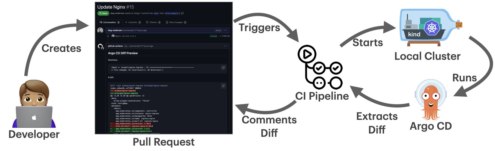

# Previewing Argo CD Applications on Pull Requests in Seconds

> **TL;DR**: You can now render previews of your PRs by reusing an existing cluster instead of spinning up a new one each run. This results in very short preview times while maintaining accuracy. 

This is a continuation of my first blog post: [Rendering the TRUE Argo CD diff on your PRs](https://dev.to/dag-andersen/rendering-the-true-argo-cd-diff-on-your-prs-10bk). That article addresses a critical challenge in GitOps workflows: visualizing the actual impact of configuration changes when using templating tools like Helm and Kustomize.

## The simplest approach: Accurate but Slow

The original solution spins up ephemeral Kubernetes clusters inside your CI/CD pipeline, letting Argo CD itself render the manifests. This ensures maximum accuracy since the same engine that will deploy your changes generates the preview.


**Why this approach is superior to alternative tools:**
- **True accuracy**: Uses Argo CD itself rather than tools that try to mimic its rendering logic
- **No infrastructure access required**: Works without credentials to your production Argo CD instance
- **Complete isolation**: Runs in complete isolation from your production systems

However, this approach has one significant limitation: **Speed**. Creating a cluster and installing Argo CD takes 60-90 seconds every time, making even simple configuration changes take 80+ seconds to preview.

This overhead adds 60-90 seconds to every run, regardless of how simple your configuration changes might be.

## Speed: The Bottleneck and the Solution

Instead of creating a new ephemeral cluster each time, `argocd-diff-preview` can now connect to a pre-existing cluster with Argo CD already installed. This reduces preview times from minutes to seconds.

### How It Works

1. Scan both branches (base and target) for Argo CD Applications and ApplicationSets
2. Temporarily create these applications with unique identifiers in your dedicated Argo CD instance
3. Extract the rendered manifests from Argo CD
4. Clean up by deleting the temporary applications
5. Generate the diff between the two sets of rendered manifests

**Key benefits:**
- **Same accuracy**: Still uses Argo CD itself for rendering
- **Faster execution**: Eliminates the 60-90 second cluster creation overhead
- **Concurrent runs**: Multiple PRs can run simultaneously with unique identifiers
- **Caching benefits**: Shared repository and Helm chart caches improve performance

### Concurrent Runs: Multiple PRs, No Conflicts
Applications briefly appear and disappear in the Argo CD UI during a preview.
Each run uses a unique identifier, so multiple PRs can run without collisions.

## Three Approaches to Preview Generation

### Approach 1: Ephemeral Clusters (Original)

This is the approach described in the [first blog post](https://dev.to/dag-andersen/rendering-the-true-argo-cd-diff-on-your-prs-10bk). The tool creates a fresh Kubernetes cluster for each preview run.



**How it works:**
- Creates a fresh Kubernetes cluster (kind, k3d, or minikube)
- Installs Argo CD from scratch
- Applies your applications and extracts rendered manifests
- Destroys the cluster when done

**Trade-offs:**
- ✅ Zero setup
- ✅ Complete isolation
- ✅ Works with any CI/CD
- ❌ Slow (60-90 second overhead per run)
- ❌ Resource intensive (Creates a new cluster for each run)

### Approach 2: Reusing Cluster

Connect to a pre-existing cluster with Argo CD already installed, eliminating the cluster creation overhead.


**Requirements:**
- A dedicated Argo CD instance installed in a cluster with access to the same repositories and Helm registries as your _normal_ Argo CD instance
- The default `admin` user is enabled and the `default` project exists
- KubeConfig or service account credentials for your cluster available to your CI/CD pipeline


**Quick Demo:**
```bash
# Create cluster and install Argo CD (one-time setup)
kind create cluster --name diff-preview-cluster
helm repo add argo https://argoproj.github.io/argo-helm
helm install argo-cd argo/argo-cd --version 8.0.3

# Clone branches for each PR
git clone https://github.com/dag-andersen/argocd-diff-preview base-branch --depth 1 -q 
git clone https://github.com/dag-andersen/argocd-diff-preview target-branch --depth 1 -q -b helm-example-3

# Run the tool (connects to the kind cluster)
docker run \
  --network host \
  -v ~/.kube:/root/.kube \
  -v /var/run/docker.sock:/var/run/docker.sock \
  -v $(pwd)/output:/output \
  -v $(pwd)/base-branch:/base-branch \
  -v $(pwd)/target-branch:/target-branch \
  -e TARGET_BRANCH=helm-example-3 \
  -e REPO=dag-andersen/argocd-diff-preview \
  dagandersen/argocd-diff-preview:v0.1.18 \
  --argocd-namespace=default \
  --create-cluster=false
```

**Trade-offs:**
- ✅ Fast execution (eliminates 60-90s overhead)
- ❌ Infrastructure setup required (Setup cluster with Argo CD beforehand) 
- ❌ Cluster credentials in CI/CD pipeline

### Approach 3: Reusing Cluster + Self-Hosted Runner

For organizations concerned about credential sharing, run the pipeline from inside the same cluster as your dedicated Argo CD instance using GitHub Actions self-hosted runners.


**The Process:**
1. Install Action Runner Controller (ARC) in your cluster alongside the dedicated Argo CD instance
2. The tool runs exactly as before, but without any credential management complexity

**Trade-offs:**
- ✅ Fast execution (eliminates 60-90s overhead)
- ✅ Network isolation (No need to expose your cluster to the internet)
- ✅ No cluster credentials in CI/CD pipeline because you are using a service account from within the cluster and Argo CD already has all the credentials it needs
- ❌ Most complex setup (requires ARC + dedicated Argo CD)

> **Note**: For complete setup instructions, see the [self-hosted runner guide](../reusing-clusters/self-hosted-gh-runner.md).

## Optimizing for Large Repositories

Even with existing clusters, repositories with hundreds of applications can take 1+ minutes to render. The solution is selective rendering using annotations.

The most powerful optimization is the `argocd-diff-preview/watch-pattern` annotation. This tells the 
tool exactly which files each application cares about, enabling surgical precision in rendering. An 
application will only be rendered if any of the watch patterns match the changed files in the PR.
### Smart Application Selection

**How it works:**
1. Add the `argocd-diff-preview/watch-pattern` annotation to your Applications and ApplicationSets
2. Provide the tool with a list of changed files from your PR
3. Only applications whose watch patterns match the changed files will be rendered

Use the `argocd-diff-preview/watch-pattern` annotation to tell the tool exactly which files each application cares about:

```yaml
apiVersion: argoproj.io/v1alpha1
kind: Application
metadata:
  name: my-app
  namespace: argocd
  annotations:
    argocd-diff-preview/watch-pattern: "apps/my-app/.*, shared/values.yaml"
spec:
  source:
    path: apps/my-app
    # ...
```

This application will only render if:
- Any file in the `apps/my-app/` directory changes
- The `shared/values.yaml` file changes
- The application's own manifest file changes (automatic)

More information about the `watch-pattern` annotation can be found in the [application-selection](../application-selection.md) documentation.

**Other selection methods:**
- **Ignore applications**: `argocd-diff-preview/ignore: "true"`
- **Filter by labels**: `--selector "team=frontend"`
- **Filter by path**: `--file-regex="/team-a/"`

**Performance impact**: Instead of rendering 100+ applications (60+ seconds), render only 6-10 relevant applications (~10 seconds).

For complete details, see the [application-selection documentation](./application-selection.md).

## Comparison: Which Approach to Choose?

| Approach | Best For | Pros | Cons |
|----------|----------|------|------|
| **Ephemeral clusters** | Getting started, Full isolation | • Simple setup<br>• Complete isolation | • Slow (60-90s overhead) |
| **Existing cluster** | Teams prioritizing speed | • Fast <br>• Leverages Argo CD caching | • Requires dedicated Argo CD setup<br>• Need cluster credentials in CI/CD<br>• Infrastructure maintenance |
| **Existing cluster + self-hosted runner** | Teams prioritizing speed AND security | • Fast + secure<br>• Leverages Argo CD caching<br>• No credentials in CI/CD | • Most complex setup<br> • Requires dedicated Argo CD and self-hosted runner setup<br>• Infrastructure maintenance |

## Real-World Results

At [Egmont](https://www.egmont.com), we use the self-hosted runner approach with a repository containing 600+ applications. Combined with smart application selection, we achieve preview times under 10 seconds - an 20x improvement over the original "ephemeral cluster" approach.

The key is combining two optimizations:
1. **Use an existing cluster** to eliminate cluster creation overhead
2. **Select only affected applications** using watch patterns to minimize rendering scope

This approach maintains the accuracy that makes `argocd-diff-preview` superior to alternatives while delivering the speed needed for practical daily use.

## Conclusion

The evolution of `argocd-diff-preview` proves you don't have to choose between accuracy and speed. What started as an accurate-but-slow solution has matured into a flexible tool that adapts to your team's needs—whether you prioritize simplicity, speed, or security.

Throughout this journey, one principle has remained constant: **use Argo CD itself to render manifests**. This ensures your previews perfectly match what will actually deploy. What's transformed is the speed at which this happens. By reusing existing clusters and intelligently selecting applications, we've compressed preview times from minutes to seconds—making the feedback loop fast enough for practical daily use

The path forward is straightforward: begin with the ephemeral cluster approach to get familiar with the tool. As your confidence grows and speed becomes a priority, transition to a dedicated cluster setup. For teams managing hundreds of applications, layer on smart application selection to achieve sub-10-second previews, even at scale.

The result? Preview times under 10 seconds with the same accuracy you started with 🎉

---

For detailed setup instructions, check out:
- [Existing cluster documentation](../reusing-clusters/connecting.md)
- [Self-hosted runner guide](../reusing-clusters/self-hosted-gh-runner.md)
- [Application selection options](../application-selection.md)