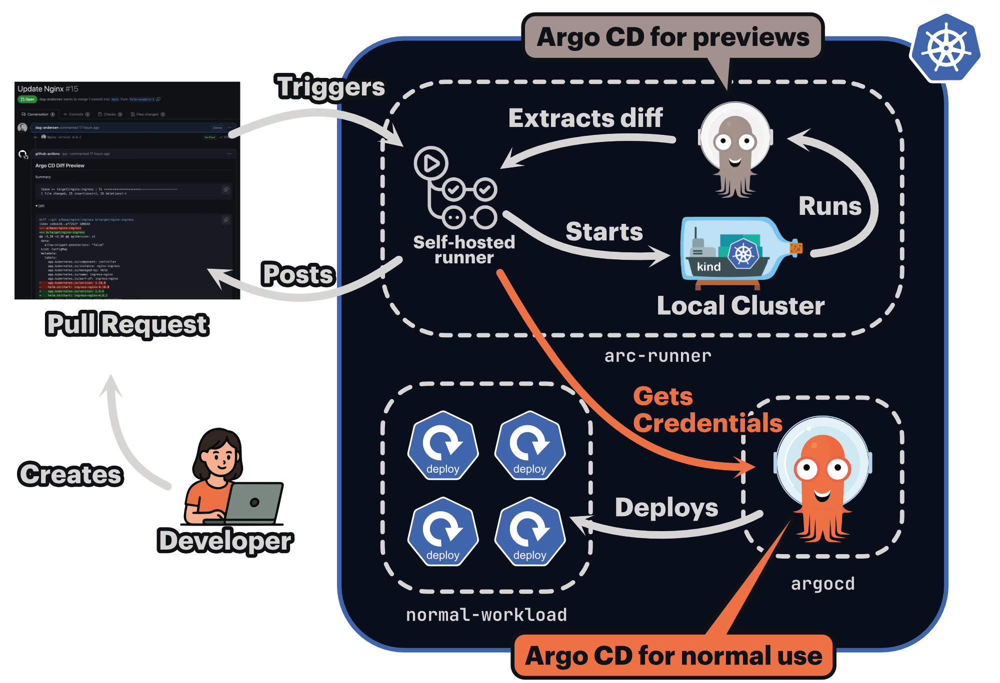

# Self-Hosted GitHub Actions Runners on Kubernetes

Running `argocd-diff-preview` with self-hosted GitHub Actions runners inside your Kubernetes cluster offers significant advantages over GitHub-hosted runners. Most notably, you can directly access Argo CD's cluster and GitHub/GitLab credentials from the host cluster, eliminating the need to store credentials in your CI/CD pipeline.

This guide covers two main approaches for using self-hosted runners with `argocd-diff-preview`.

---

## Approach 1: Ephemeral Cluster inside Runner Pod

This approach creates a temporary cluster for each diff preview run while reusing credentials from your existing Argo CD installation. It provides isolation for the diff preview while not storing the credentials in your CI/CD pipeline.



### How It Works

When your self-hosted runner pod runs inside the same cluster as Argo CD:

1. The runner can access Argo CD secrets using `kubectl get secrets -n argocd`
2. These secrets are extracted and cleaned of cluster-specific metadata
3. The secrets are mounted into the `argocd-diff-preview` container
4. An ephemeral cluster is created with these credentials pre-configured
5. The diff preview runs with full access to your Git repositories and Helm registries

### Benefits

- **Secure credential access** - No need to expose secrets to GitHub. The credentials are read directly from the host cluster and they are always in sync
- **Isolated execution** - Each run creates a fresh, ephemeral cluster. Never interacts with your "real" Argo CD instance.
- **Easy cleanup** - Ephemeral clusters are automatically removed.

### Example Workflow

This example is meant for inspiration. You can structure it in many different ways.

```yaml title=".github/workflows/generate-diff.yml" linenums="1" hl_lines="11 30-67 76"
name: Diff Preview

on:
  pull_request:
    branches:
      - main

jobs:
  diff-preview:
    name: Diff Preview
    runs-on: your-arc-runner  # Replace with your self-hosted runner label
    permissions:
      contents: read
      pull-requests: write

    steps:
      - uses: actions/checkout@v4
        with:
          path: pull-request
          fetch-depth: 0

      - uses: actions/checkout@v4
        with:
          ref: main
          path: main

      - uses: azure/setup-kubectl@v4
        id: install

      # Extract secrets from the host cluster and prepare them for the ephemeral cluster
      - name: Get secrets from host cluster
        run: |
          mkdir -p secrets

          # Get all Argo CD secrets from the host cluster
          kubectl get secrets -n argocd -o json -l argocd.argoproj.io/secret-type > argocd-secrets.json

          # Clean up cluster-specific metadata that shouldn't be transferred
          jq '{
            apiVersion: "v1",
            kind: "List",
            items: [
              .items[] 
              | del(
                  .metadata.annotations,
                  .metadata.creationTimestamp,
                  .metadata.ownerReferences,
                  .metadata.resourceVersion,
                  .metadata.selfLink,
                  .metadata.uid,
                  .metadata.managedFields
                ) 
              | .metadata.namespace = "argocd"
            ]
          }' argocd-secrets.json > processed-secrets.json

          # Split into individual files
          counter=1
          jq -c '.items[]' processed-secrets.json | while IFS= read -r line; do
            if [ -n "$line" ]; then
              echo "$line" | jq '.' > "secrets/manifest-$(printf "%03d" $counter).json"
              counter=$((counter + 1))
            fi
          done

          # Clean up temporary files
          rm -f argocd-secrets.json processed-secrets.json

      - name: Generate Diff
        run: |
          docker run \
            --network=host \
            -v /var/run/docker.sock:/var/run/docker.sock \
            -v $(pwd)/main:/base-branch \
            -v $(pwd)/pull-request:/target-branch \
            -v $(pwd)/secrets:/secrets \
            -v $(pwd)/output:/output \
            -e TARGET_BRANCH=refs/pull/${{ github.event.number }}/merge \
            -e REPO=${{ github.repository }} \
            dagandersen/argocd-diff-preview:v0.1.25

      - name: Post diff as comment
        run: |
          gh pr comment ${{ github.event.number }} --repo ${{ github.repository }} --body-file output/diff.md --edit-last || \
          gh pr comment ${{ github.event.number }} --repo ${{ github.repository }} --body-file output/diff.md
        env:
          GITHUB_TOKEN: ${{ secrets.GITHUB_TOKEN }}
```

---

## Approach 2: Connecting to a pre-configured Argo CD

For enhanced security and performance, you can skip the ephemeral cluster creation entirely and use a pre-configured Argo CD instance directly. This approach is covered in detail in the [Connecting the self-hosted runner to Argo CD on the host cluster](../reusing-clusters/self-hosted-gh-runner.md) guide.

---

## Handling CIDR Collisions

When using Action Runner Controller (ARC) to self-host your GitHub Actions runners, the ephemeral kind cluster created by `argocd-diff-preview` may have CIDR ranges that conflict with your host cluster's network configuration. These overlapping ranges can cause networking issues during the diff preview process.

### Default CIDR Ranges

The kind cluster uses these default CIDR ranges:

| Type    | CIDR Range    |
| ------- | ------------- |
| Service | 10.96.0.0/16  |
| Pod     | 10.244.0.0/16 |

If these ranges overlap with your host cluster's CIDRs, you'll need to configure custom ranges for the ephemeral cluster.

### Configuring Custom CIDRs

**Step 1: Create a kind configuration file**

Create a file in your repository (e.g., `hack/kind.yaml`) with non-overlapping CIDR ranges:

```yaml title="hack/kind.yaml"
kind: Cluster
apiVersion: kind.x-k8s.io/v1alpha4
networking:
  serviceSubnet: "10.80.0.0/16"
  podSubnet: "10.128.0.0/16"
```

**Step 2: Pass the configuration to `argocd-diff-preview`**

Add the `--kind-options` flag to your workflow to use the custom configuration:

```yaml title=".github/workflows/generate-diff.yml" hl_lines="17"
      - name: Generate Diff
        run: |
          docker run \
            --network=host \
            -v /var/run/docker.sock:/var/run/docker.sock \
            -v $(pwd)/main:/base-branch \
            -v $(pwd)/pull-request:/target-branch \
            -v $(pwd)/output:/output \
            -e TARGET_BRANCH=refs/pull/${{ github.event.number }}/merge \
            -e REPO=${{ github.repository }} \
            dagandersen/argocd-diff-preview:v0.1.25 \
            --kind-options '--config /base-branch/hack/kind.yaml'
```
