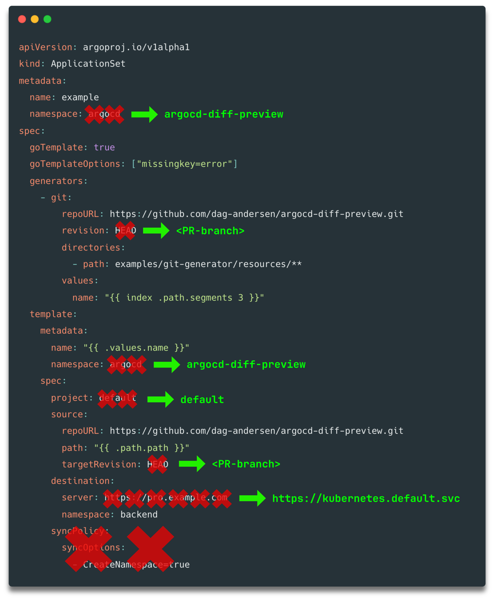
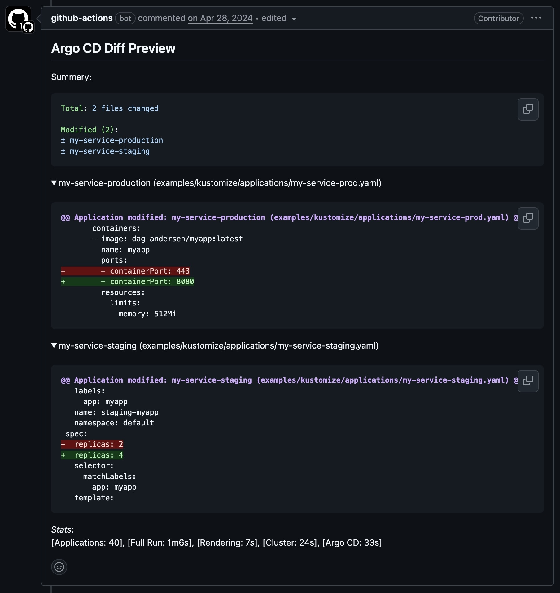

# How it works

This page describes how `argocd-diff-preview` works under the hood.

The tool follows a simple but powerful approach: use a real Argo CD instance to render your manifests and compare the results between branches. This ensures the diff is 100% accurate - exactly what Argo CD would produce in your real cluster.

## Modes

#### Ephemeral Cluster Mode


#### Pre-installed Argo CD Mode


---

When you run the tool, it follows these steps:

## Step 1: Fetch Applications

The tool collects all resources from the `base-branch` and `target-branch` folders for all YAML files containing:

- `kind: Application`
- `kind: ApplicationSet`

---

## Step 2: Select/Filter Applications

Before processing, the tool filters which applications to render. By default, all applications are rendered, but you can limit this using several strategies:

| Strategy | How it works |
|----------|--------------|
| **Watch patterns** | Add `argocd-diff-preview/watch-pattern` annotation to only render apps when specific files change |
| **Ignore annotation** | Add `argocd-diff-preview/ignore: "true"` to skip specific applications entirely |
| **Label selectors** | Use `--selector "team=platform"` to filter by Kubernetes labels |
| **File path regex** | Use `--file-regex="team-a/"` to filter by the application's file location |

This is especially useful in large monorepos where rendering all applications on every PR would be slow. See [Application Selection](./application-selection.md) for more details.

!!! note "Early exit if no applications selected"
    If no applications are selected after filtering, the tool stops here and outputs an empty diff. This avoids spinning up a cluster unnecessarily.

---

## Step 3: Patch Applications

For each Application or ApplicationSet found, it applies the following modifications:

| Modification | Why |
|--------------|-----|
| Set `metadata.namespace` to `argocd` | So Argo CD can find and manage the applications. This is overridden by the `--argocd-namespace` flag.|
| Remove `spec.syncPolicy` | Prevents Argo CD from actually syncing resources to the cluster |
| Set `spec.project` to `default` | The ephemeral Argo CD only has the `default` project configured |
| Set `spec.destination.server` to `https://kubernetes.default.svc` | Points to the local cluster (the actual destination doesn't matter since we're only rendering, not syncing) |
| Set `spec.source.targetRevision` to the branch name | So Argo CD renders manifests from the correct branch |
| Set `spec.sources[*].targetRevision` to the branch name | Same as above, but for multi-source applications |
| Set `spec.generators[*].git.revision` to the branch name | For ApplicationSets using Git generators (including nested Matrix/Merge generators) |

<p align="center">
  
</p>

---

!!! note "Steps 4-6: Ephemeral Cluster Mode Only"
    Steps 4, 5, and 6 only apply when using the default ephemeral cluster mode. If you're connecting to a pre-installed Argo CD instance with `--create-cluster=false`, these steps are skipped and the tool connects directly to your pre-installed Argo CD.

---

## Step 4: Start local cluster

The tool creates a local ephemeral Kubernetes cluster using one of the supported local cluster tools:

- **Kind** (default)
- **Minikube**
- **k3d**

`argocd-diff-preview` practically just runs: 

```bash
kind create cluster --name argocd-diff-preview
```

---

## Step 5: Install Argo CD

Argo CD is installed using the official [Argo CD Helm Chart](https://artifacthub.io/packages/helm/argo/argo-cd). By default, the latest version is installed, but you can specify a version with `--argocd-chart-version`.

You can customize the installation by mounting a `values.yaml` file. This is useful for:

- Enabling Config Management Plugins (CMPs)
- Configuring Kustomize build options
- Any other Argo CD Helm chart customization

See [Custom Argo CD Installation](./getting-started/custom-argo-cd-installation.md) for details.

`argocd-diff-preview` practically just runs:

```bash
helm install my-argo-cd argo/argo-cd --version x.x.x
```

---

## Step 6: Apply credentials

If your repository is private, you need to provide the tool with the necessary credentials.

You can do this by mounting a `/secrets` folder:

??? example "Example: GitHub Actions workflow with secrets"
    ```yaml
    - name: Prepare secrets
      run: |
        mkdir secrets
        cat > secrets/secret.yaml << "EOF"
        apiVersion: v1
        kind: Secret
        metadata:
          name: private-repo
          namespace: argocd
          labels:
            argocd.argoproj.io/secret-type: repo-creds
        stringData:
          url: https://github.com/${{ github.repository }}
          password: ${{ secrets.GITHUB_TOKEN }}  ⬅️ Short-lived GitHub Token
          username: not-used
        EOF

    - name: Generate Diff
      run: |
        docker run \
          --network=host \
          -v /var/run/docker.sock:/var/run/docker.sock \
          -v $(pwd)/main:/base-branch \
          -v $(pwd)/pull-request:/target-branch \
          -v $(pwd)/output:/output \
          -v $(pwd)/secrets:/secrets \           ⬅️ Mount the secrets folder
          -e TARGET_BRANCH=refs/pull/${{ github.event.number }}/merge \
          -e REPO=${{ github.repository }} \
          dagandersen/argocd-diff-preview:v0.1.21
    ```

All resources in the `/secrets` folder are applied to the cluster. The relevant secrets are typically included in the `/secrets` folder:

- **Repository credentials** - For accessing private Git repositories
- **Helm chart credentials** - For private Helm registries (including OCI)
- **Cluster secrets** - For ApplicationSets using the Cluster generator

These secrets use the standard [Argo CD secret format](https://argo-cd.readthedocs.io/en/stable/operator-manual/argocd-repo-creds-yaml/).

`argocd-diff-preview` practically just runs:

```bash
kubectl apply -f /secrets
```

---

## Step 7: Generate Applications from ApplicationSets

For each ApplicationSet found, it generates the applications using the Argo CD CLI:

```bash
argocd appset generate <app-set-name>
```

This returns a list of applications.

The newly generated applications also go through `Step 2` and `Step 3` (filtering and patching).

---

## Step 8: Apply applications to the cluster

The patched applications are applied to the cluster.

`argocd-diff-preview` practically just runs:

```bash
kubectl apply -f <patched-applications>
```

At this point, Argo CD starts processing each application - rendering the applications.

---

## Step 9: Wait for Argo CD to render

The tool will repeatedly check the status of each application and extract the rendered manifests as they become ready.

The tool will poll the applications until they're ready or the timeout is reached (default: 180 seconds).

It practically just waits for the Application to look like this:

<p align="center">
  
</p>

---

## Step 10: Extract rendered manifests

Once applications are ready, the tool extracts the rendered manifests using the Argo CD CLI:

```bash
argocd app manifests <app-name>
```

This returns the exact YAML generated by the applications - fully rendered with all Helm values substituted and Kustomize patches applied.

---

## Step 11: Generate the diff

<p align="center">
  
</p>

The tool compares the two sets of manifests and generates a diff. The comparison is done per-application, showing:

- **Added applications** - New in target branch
- **Removed applications** - Deleted in target branch  
- **Modified applications** - Changed between branches
- **Unchanged applications** - No differences (not shown in output)

The diff respects the `--diff-ignore` option to filter out noisy changes. Documentation: [Ignore specific lines in the diff preview](./filter-output.md#ignore-specific-lines)

---

## Step 12: Output the results

The tool writes several files to the output folder (`./output/` by default):

| File | Description |
|------|-------------|
| `./output/diff.md` | Markdown diff - ready to post as a PR comment |
| `./output/diff.html` | HTML diff - visual side-by-side comparison |
| `./output/base-branch.yaml` | Single manifest with all rendered resources from base branch |
| `./output/target-branch.yaml` | Single manifest with all rendered resources from target branch |
| `./output/base/<app-name>.yaml` | Individual manifests for each app rendered from base branch |
| `./output/target/<app-name>.yaml` | Individual manifests for each app rendered from target branch |

The Markdown output is designed to be posted directly to your pull request using `gh pr comment` or equivalent.
