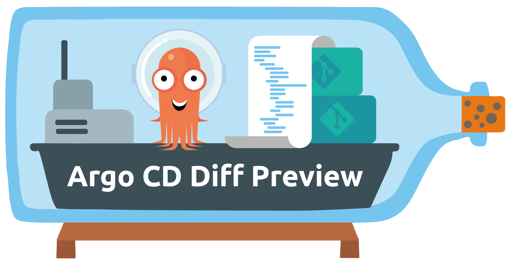

# Overview

Argo CD Diff Preview is a tool that renders the diff between two branches in a Git repository. It is designed to render manifests generated by Argo CD, providing a clear and concise view of the changes between two branches. It operates similarly to Atlantis for Terraform, creating a plan that outlines the proposed changes.

### 3 Example Pull Requests:
- [Helm Example | Internal Chart](https://github.com/dag-andersen/argocd-diff-preview/pull/16)
- [Helm example | External Chart: Nginx](https://github.com/dag-andersen/argocd-diff-preview/pull/15)
- [Kustomize Example](https://github.com/dag-andersen/argocd-diff-preview/pull/12)

---

## Overview

The safest way to make changes to you Helm Charts and Kustomize Overlays in your GitOps repository is to let Argo CD render them for you. This can be done by spinning up an ephemeral cluster in your automated pipelines. Since the diff is rendered by Argo CD itself, it is as accurate as possible.

The implementation is actually quite simple. It just follows the steps below:

## 10 Steps
1. Start a local cluster
2. Install Argo CD
3. Add the required credentials (git credentials, image pull secrets, etc.)
4. Fetch all Argo CD applications from your PR branch
   - Point their `targetRevision` to the Pull Request branch
   - Remove the `syncPolicy` from the applications (to avoid the applications syncing locally)
5. Apply the modified applications to the cluster
6. Let Argo CD do its magic
7. Extract the rendered manifests from the Argo CD server
8. Repeat steps 4–7 for the base branch (main branch)
9. Create a diff between the manifests rendered from each branch
10. Display the diff in the PR

## Features

- Renders manifests generated by Argo CD
- Does not require access to your real cluster or Argo CD instance. The tool runs in complete isolation.
- Can be run locally before you open the pull request
- Works with private repositories and Helm charts
- Provides a clear and concise view of the changes
- Render resources from external sources (e.g., Helm charts). For example, when you update the chart version of Nginx, you can get a render of the new output. For example, this is useful to spot changes in default values. [PR example](https://github.com/dag-andersen/argocd-diff-preview/pull/15). 

## Why do we need this?

In the Kubernetes world, we often use templating tools like Kustomize and Helm to generate our Kubernetes manifests. These tools make maintaining and streamlining configuration easier across applications and environments. However, they also make it harder to visualize the application's actual configuration in the cluster.

Mentally parsing Helm templates and Kustomize patches is hard without rendering the actual output. Thus, making mistakes while modifying an application's configuration is relatively easy.

In the field of GitOps and infrastructure as code, all configurations are checked into Git and modified through PRs. The code changes in the PR are reviewed by a human, who needs to understand the changes made to the configuration. This is hard when the configuration is generated through templating tools like Kustomize and Helm.

## ArgoCon 2024 Talk

 `argocd-diff-preview` was presented at ArgoCon 2024 in Utah, US. The talk covered current tools and methods for visualizing code changes in GitOps workflows and introduced this new approach, which uses ephemeral clusters to render accurate diffs directly on your pull requests.

- Talk description: [GitOps Safety: Rendering Accurate ArgoCD Diffs Directly on Pull Requests](
https://colocatedeventsna2024.sched.com/event/1izsL/gitops-safety-rendering-accurate-argocd-diffs-directly-on-pull-requests-dag-bjerre-andersen-visma-regina-voloshin-octopus-deploy)
- Talk recording: [YouTube](https://youtu.be/3aeP__qPSms)

## Contributing

We welcome contributions to ArgoCD Diff Preview! Whether you want to fix bugs, add new features, or improve documentation, your help is appreciated.

Please check out our [contribution guidelines](https://github.com/dag-andersen/argocd-diff-preview/blob/main/CONTRIBUTING.md) for details on how to set up your development environment, run tests, and submit changes.