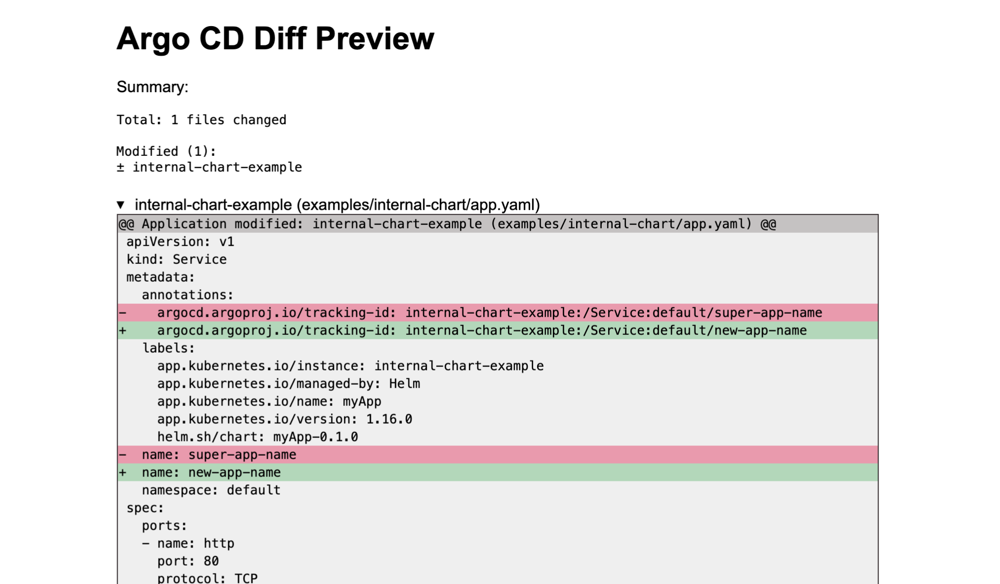

# Output formats

## Markdown

The tool creates a Markdown file at `./output/diff.md`.

## HTML

The tool creates an HTML file at `./output/diff.html`.

## Fully rendered manifests

After rendering the manifests for each branch, the tool stores the compared output in two files: `./output/base-branch.yaml` and `./output/target-branch.yaml`. These files are long YAML documents containing all the rendered manifests.

You can pass this output into any tool you like. For example, you could feed those files into [kube-score](https://github.com/zegl/kube-score) to check whether the score of your new branch goes up or down.