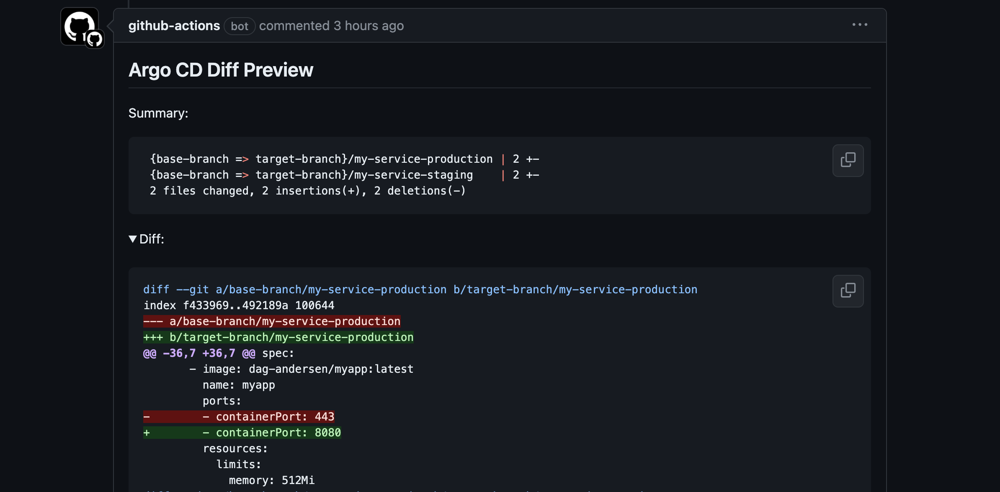
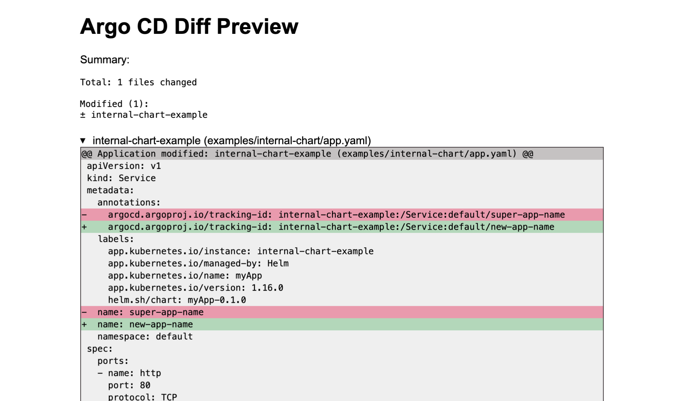

# Output formats

## Markdown

The tool creates a Markdown file at `./output/diff.md`.

## HTML

The tool creates an HTML file at `./output/diff.html`.

## Fully rendered manifests

The tool can optionally write the fully rendered manifests to disk via two flags:

### `--output-branch-manifests`

Writes all application manifests for each branch concatenated into a single file:

- `./output/base-branch.yaml`
- `./output/target-branch.yaml`

These files are always created when the flag is set — even if all applications rendered to empty output (the file will be empty in that case). You can pipe this output into any tool you like. For example, you could feed those files into [kube-score](https://github.com/zegl/kube-score) to check whether the score of your new branch goes up or down.

### `--output-app-manifests`

Writes each application's manifests to its own file, organised into branch-specific folders:

- `./output/base/<app-id>`
- `./output/target/<app-id>`

A file is written for every application, even if it rendered to empty output — so you can see at a glance which applications existed on each branch.