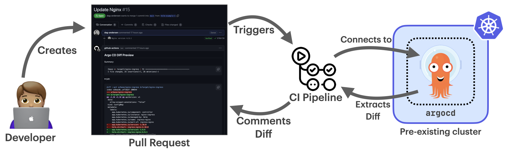

# Connecting to an already running cluster



Instead of spinning up an ephemeral cluster for each diff preview, you can connect to an existing cluster. This saves approximately `60`–`90` seconds per run.

**Important:** We highly recommend **not** using your production Argo CD instance for rendering manifests. Instead, install a dedicated Argo CD instance for diff previews.

The Argo CD server does not need to be exposed to the internet, since `argocd-diff-preview` connects via a KubeConfig file (or service account).

To use this feature, mount a valid KubeConfig with access to the cluster and provide these options:

```bash
--create-cluster false --argocd-namespace <namespace>
```

This will skip cluster creation and connect to Argo CD via port-forwarding in the specified namespace.

## Requirements

- The default `admin` user must not be disabled in Argo CD.
- The `default` Argo CD project must exist.
- The required secrets for authentication have already been added to the cluster.

## Example Demo

### _Step 1_: Create cluster (skip if you already have a cluster with Argo CD installed)
```bash
kind create cluster --name existing-cluster
helm repo add argo https://argoproj.github.io/argo-helm
helm install argo-cd argo/argo-cd --version 8.0.3
```

### _Step 2_: Clone the base and target branches
```bash
# Clone the base branch into a subfolder called `base-branch`
git clone https://github.com/dag-andersen/argocd-diff-preview base-branch --depth 1 -q 

# Clone the target branch into a subfolder called `target-branch`
git clone https://github.com/dag-andersen/argocd-diff-preview target-branch --depth 1 -q -b helm-example-3
```

### _Step 3_: Run the tool

Make sure you:
- Mount the KubeConfig into the container (`-v ~/.kube:/root/.kube`)
- Disable cluster creation (`--create-cluster=false`)
- Specify the Argo CD namespace (`--argocd-namespace=<ns>`)

```bash
docker run \
  --network host \
  -v ~/.kube:/root/.kube \
  -v /var/run/docker.sock:/var/run/docker.sock \
  -v $(pwd)/output:/output \
  -v $(pwd)/base-branch:/base-branch \
  -v $(pwd)/target-branch:/target-branch \
  -e TARGET_BRANCH=helm-example-3 \
  -e REPO=dag-andersen/argocd-diff-preview \
  dagandersen/argocd-diff-preview:v0.1.18 \
  --argocd-namespace=default \
  --create-cluster=false
```

And then the output will look something like this:

```
✨ Running with:
✨ - reusing existing cluster
✨ - base-branch: main
✨ - target-branch: helm-example-3
✨ - output-folder: ./output
✨ - argocd-namespace: default
✨ - repo: dag-andersen/argocd-diff-preview
✨ - timeout: 180 seconds
🔑 Unique ID for this run: 60993
🤖 Fetching all files for branch (branch: main)
🤖 Found 52 files in dir base-branch (branch: main)
...
🤖 Fetching all files for branch (branch: helm-example-3)
🤖 Found 52 files in dir target-branch (branch: helm-example-3)
...
🦑 Logging in to Argo CD through CLI...
🦑 Logged in to Argo CD successfully
🤖 Converting ApplicationSets to Applications in both branches
...
🤖 Patching 19 Applications (branch: main)
🤖 Patching 19 Applications (branch: helm-example-3)
🤖 Rendered 11 out of 38 applications (timeout in 175 seconds)
🧼 Waiting for all application deletions to complete...
🧼 All application deletions completed
🤖 Got all resources from 19 applications from base-branch and got 19 from target-branch in 7s
🔮 Generating diff between main and helm-example-3
🙏 Please check the ./output/diff.md file for differences
✨ Total execution time: 10s
```

## Authenticate with Cloud Providers

If you're connecting to a cluster on a cloud provider, you often use a plugin or [ExecConfig](https://kubernetes.io/docs/reference/config-api/kubeconfig.v1/#ExecConfig) to authenticate (for example, `kubelogin` for Azure AKS or `aws eks get-token` for AWS EKS).

You can check this by running `kubectl config view --minify -o jsonpath='{.users[*].user}'` and looking for the `command` field.

These plugins/binaries are **not** available inside the Docker image, so you'll need to run `argocd-diff-preview` as a standalone binary.

You can find installation instructions in the [docs](https://dag-andersen.github.io/argocd-diff-preview/installation/#__tabbed_1_2).
