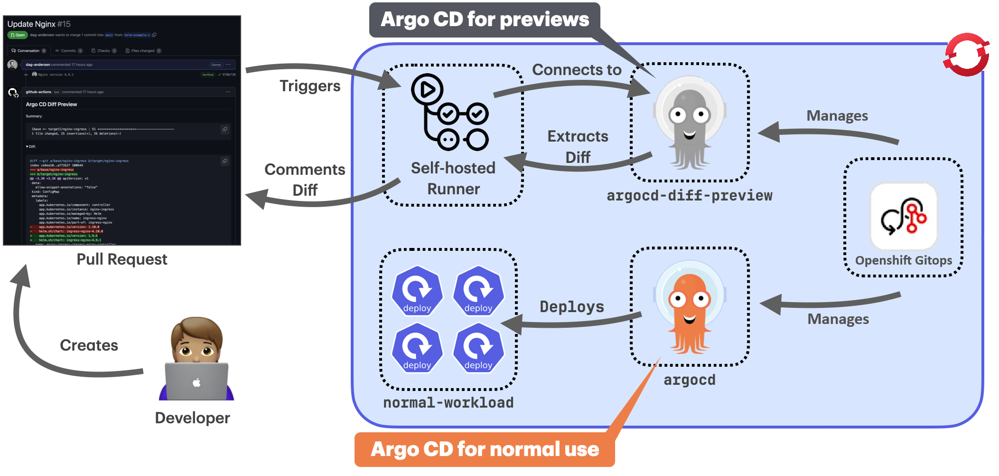

# Setup a dedicated ArgoCD instance in Openshift

Running `argocd-diff-preview` against a cluster that has Argo CD pre-installed combines maximum performance with enhanced security. This approach eliminates both cluster creation overhead and the need to store cluster credentials in your CI/CD pipeline. 

Utilizing the Openshift GitOps operator for managing the pre-installed ArgoCD instance comes with low overhead of managing another ArgoCD instance. It is included in the Operator upgrade process and is in line with the ArgoCD instances in the cluster used to deploy applications. In this setup, there is also no need to run `argocd-diff-preview` as DinD (Docker in Docker) which further increases security. In addition, if there are network settings in place in order to access private repositories outside of the Openshift cluster, this will work right away with this setup. If the main ArgoCD instance is also used to deploy its own configuration (e.g. ssh-known-hosts, tls certs, etc.) in a GitOps way, the instance for `argocd-diff-preview` can be configured in the same way for faster integration.

Imagine something like this:



## How it works

1. **Configure dedicated ArgoCD instance managed by Openshift GitOps Operator** in your cluster in the namespace `argocd-diff-preview`
2. **Setup a runner** in the cluster and connect it to your CI system
2. **The runner uses a service account** to connect to the host cluster and access the Argo CD instance
3. **The tool runs exactly as before**, but without any credential management complexity and without creating an ephemeral cluster

## Setup Guide

### 1. Create a dedicated ArgoCD instance for rendering previews

1. Open the Administrator view in the Openshift UI
2. Go to **Operators -> Installed Operators -> Red Hat OpenShift GitOps**
3. In the **ArgoCD** tab click **Create ArgoCD** and configure via **YAML view**
4. Provide `argocd` as the new name of the ArgoCD instance in the field `metadata.name` (important as argocd-diff-preview expects that name) 
5. Provide the target namespace in `metadata.namespace` (e.g.`argocd-diff-preview`) in the yaml manifest.
6. Click **Create**

By default, this action will create a namespace-scoped ArgoCD instance.

### 2. Make the new ArgoCD instance cluster-scoped

To provide ArgoCD with enough permissions to read the live state of all namespaces it needs to be cluster-scoped.

1. Open the Administrator view in the Openshift UI
2. Go to **Operators -> Installed Operators -> Red Hat OpenShift GitOps**
3. In the **Subscription** tab click **Action -> Edit Subscription**

    (Alternative is to edit the subcription over command line like so:
    `oc edit subscription  openshift-gitops-operator -n openshift-operators`)

4. Add the following entry in `spec.config.env` (this entry may not exist yet and needs to be added). The value should contain a list of your current GitOps cluster scoped instance namespaces including the new one:

    ```yaml
    ...
    kind: Subscription
    ...
    spec:
      ...
      config:
        env:
        - name: ARGOCD_CLUSTER_CONFIG_NAMESPACES
          value: openshift-gitops,argocd-diff-preview
      ...
    ```
5. Click **Save**

After this change, the Openshift GitOps controller will create a clusterrole and clusterrolebinding for the new ArgoCD instance that allows ArgoCD to read the live state within the cluster. 

To check the permissions you can investigate the newly created clusterrole and clusterrolebinding:

```bash
oc get clusterrolebindings argocd-argocd-diff-preview-argocd-application-controller -o yaml
oc get clusterroles argocd-argocd-diff-preview-argocd-application-controller -o yaml
```

An actual sync of an ArgCD application (that won't be triggered by `argocd-diff-preview` anyway) within this new ArgoCD instance would still fail, as the target namespaces are missing the label `argocd.argoproj.io/managed-by=argocd-diff-preview`.

**Background information**

`argocd-diff-preview` will call `argocd app manifest` to retrieve the rendered manifests for comparison. For this to work, the ArgoCD application has to be created without errors. Without additional permissions, one will get the following example error for applications that have a target namespace different then the one of the namespace-scoped ArgoCD instance (which will be the case for all diffs):

`Failed to load live state: namespace "default" for Service "kustomize-guestbook-ui" is not managed`

There is already a [feature reuqest](https://github.com/dag-andersen/argocd-diff-preview/issues/250) opended to make `argocd-diff-preview` work with a namespace-scoped ArgoCD instance.

### 3. Configure ArgoCD for private repositories (optional)

To reduce credential handling and private repository configuration in the CI pipeline the configuration can be done once in the dedicated ArgoCD instance. One can add repository credential templates or configure ssh-known-hosts ConfigMap for safe cloning via ssh. This offloads these tasks from the CI run that actually runs `argocd-diff-preview` which allows for a more lightweight CI integration accross different repositories.

### 4. Configure RBAC

```yaml
apiVersion: v1
kind: ServiceAccount
metadata:
  name: argocd-diff-preview-access
  namespace: argocd-diff-preview
---
kind: Role
apiVersion: rbac.authorization.k8s.io/v1
metadata:
  name: argocd-diff-preview-access
  namespace: argocd-diff-preview
rules:
  - apiGroups: ["*"]
    resources: ["*"]
    verbs: ["*"]
---
kind: RoleBinding
apiVersion: rbac.authorization.k8s.io/v1
metadata:
  name: argocd-diff-preview-access
  namespace: argocd-diff-preview
subjects:
  - kind: ServiceAccount
    name: argocd-diff-preview-access
    namespace: argocd-diff-preview
roleRef:
  kind: Role
  name: argocd-diff-preview-access
  apiGroup: rbac.authorization.k8s.io
```

### 5. Create a service account token

With the following command a service account token is created in Openshift.

`oc create token argocd-diff-preview-access --namespace argocd-diff-preview`

It can be used to login to the cluster in a CI job and create the kube config file for `argocd-diff-preview` to be able to login. In the CI example that is presented at the end this token will be saved in the variable `$ARGOCD_DIFF_PREVIEW_OPENSHIFT_SA_TOKEN`.

### 6. Create an image for a self-hosted CI runner

To use `argocd-diff-preview` as a binary and have all tools available to update a Gitlab Merge Request, an image for a Gitlab runner can be prepared.

Example Dockerfile `argocd-diff-preview-runner` based on a Red Hat UBI image:

```
FROM registry.access.redhat.com/ubi10-minimal:latest

RUN microdnf install -y curl git tar unzip && \
    rm -rf /var/cache/yum/*

# argocd CLI
# dependency of argocd-diff-preview
RUN curl -sSL -o argocd-linux-amd64 https://github.com/argoproj/argo-cd/releases/latest/download/argocd-linux-amd64 && \
    install -m 555 argocd-linux-amd64 /usr/local/bin/argocd && \
    rm argocd-linux-amd64 && \
    argocd version || true

# argocd-diff-preview CLI
RUN curl -LJO https://github.com/dag-andersen/argocd-diff-preview/releases/download/v0.1.19/argocd-diff-preview-Linux-x86_64.tar.gz && \
    tar -xvf argocd-diff-preview-Linux-x86_64.tar.gz && \
    mv argocd-diff-preview /usr/local/bin && \
    argocd-diff-preview --version

# kubectl CLI
# dependency of argocd-diff-preview, utilized by go k8s-client
RUN curl -LO https://dl.k8s.io/release/v1.34.0/bin/linux/amd64/kubectl && \
    install -m 555 kubectl /usr/local/bin/kubectl && \
    rm -f kubectl

# oc CLI
# utilized by runner to login to openshift with the argocd-diff-preview-access service account
# e.g. oc login --server "$OPENSHIFT_SERVER" -token="$ARGOCD_DIFF_PREVIEW_OPENSHIFT_SA_TOKEN"
RUN curl -L -o /tmp/oc.tar.gz https://mirror.openshift.com/pub/openshift-v4/clients/ocp/stable/openshift-client-linux.tar.gz && \
    tar -xzvf /tmp/oc.tar.gz -C /usr/local/bin oc && \
    chmod +x /usr/local/bin/oc && \
    rm -f /tmp/oc.tar.gz
```

## Usage
### 7. Create a Gitlab pipeline and run `argocd-diff-preview` as binary

The following example utilizes a Gitlab runner in the same cluster where the dedicated ArgoCD instance is setup. The key parts are:

* logging into the Openshift cluster as the ServiceAccount `argocd-diff-preview-access`
* running `argocd-diff-preview` as binary with the options `--argocd-namespace=argocd-diff-preview` and `--create-cluster=false` to use the pre-installed ArgoCD
* Update the Gitlab Merge Request with the diff using a Gitlab token that has appropriate permissions

```
default:
  tags:
    - openshift-gitlab-runner

stages:
  - diff

diff:
  image: <your-registry>/argocd-diff-preview-runner
  variables:
    OPENSHIFT_SERVER: "<your-openshift-server-url>"
    GITLAB_TOKEN: $GITLAB_PAT
  script:
    - echo "******** Running analysis ********"
    - git clone ${CI_REPOSITORY_URL} base-branch --depth 1 -q 
    - git clone ${CI_REPOSITORY_URL} target-branch --depth 1 -q -b ${CI_MERGE_REQUEST_SOURCE_BRANCH_NAME}
    # initiate kubeconfig creation that argocd-diff-preview can use
    - oc login --server "$OPENSHIFT_SERVER" --token="$ARGOCD_DIFF_PREVIEW_OPENSHIFT_SA_TOKEN"
    - |
      argocd-diff-preview \
        --repo ${CI_MERGE_REQUEST_PROJECT_PATH} \
        --base-branch main \
        --target-branch ${CI_MERGE_REQUEST_SOURCE_BRANCH_NAME} \
        --argocd-namespace=argocd-diff-preview \
        --create-cluster=false
    - |
      DIFF_BODY=$(jq -Rs '.' < $(pwd)/output/diff.md)
      NOTE_ID=$(curl --silent --header "PRIVATE-TOKEN: ${GITLAB_TOKEN}" \
          "${CI_API_V4_URL}/projects/${CI_PROJECT_ID}/merge_requests/${CI_MERGE_REQUEST_IID}/notes" | \
          jq '.[] | select(.body | test("Argo CD Diff Preview")) | .id')

      if [[ -n "$NOTE_ID" ]]; then
          echo "Deleting existing comment (ID: $NOTE_ID)..."

          curl --silent --request DELETE --header "PRIVATE-TOKEN: ${GITLAB_TOKEN}" \
              --url "${CI_API_V4_URL}/projects/${CI_PROJECT_ID}/merge_requests/${CI_MERGE_REQUEST_IID}/notes/${NOTE_ID}"
      fi

      echo "Adding new comment..."
      curl --silent --request POST --header "PRIVATE-TOKEN: ${GITLAB_TOKEN}" \
          --header "Content-Type: application/json" \
          --url "${CI_API_V4_URL}/projects/${CI_PROJECT_ID}/merge_requests/${CI_MERGE_REQUEST_IID}/notes" \
          --data "{\"body\": $DIFF_BODY}" > /dev/null

      echo "Comment added!"
  rules:
    - if: $CI_PIPELINE_SOURCE == "merge_request_event"

```