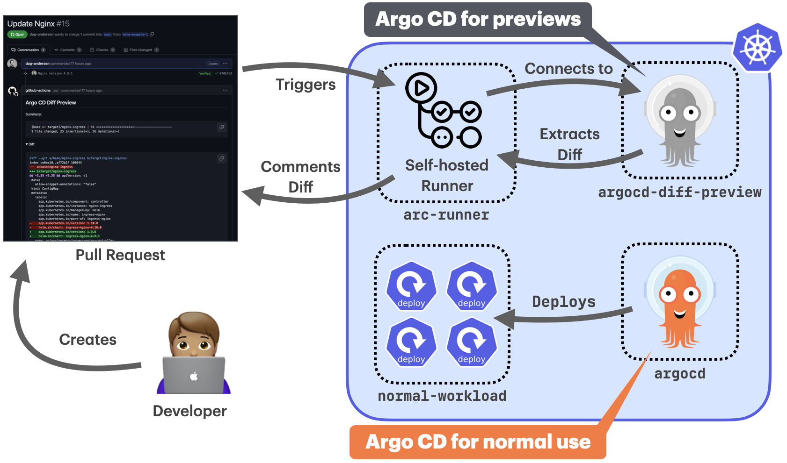

# Connecting to the host cluster from a self-hosted runner

Running `argocd-diff-preview` on a self-hosted runner with an existing Argo CD cluster combines maximum performance with enhanced security. This approach eliminates both cluster creation overhead and the need to store cluster credentials in your CI/CD pipeline.

Instead of creating a temporary cluster for each diff preview, your self-hosted GitHub Actions runner connects directly to a dedicated Argo CD instance running in the same cluster. This offers fast execution (no cluster creation overhead) and enhanced security (no credential sharing).

Imagine something like this:



## How It Works

1. **Install Action Runner Controller (ARC)** in your cluster alongside the dedicated Argo CD instance in the namespace `argocd-diff-preview`
2. **The runner uses a service account** to connect to the host cluster and access the Argo CD instance
3. **The tool runs exactly as before**, but without any credential management complexity and without creating an ephemeral cluster

---

## Setup Guide

This step-by-step guide walks you through setting up self-hosted runners with an existing Argo CD cluster.

### Step 1: Prepare Your Cluster

If you already have a cluster with Argo CD installed, skip to Step 2. Otherwise, create a dedicated cluster:

```bash
# Create a kind cluster
kind create cluster --name argocd-diff-preview

# Add Argo CD Helm repository
helm repo add argo https://argoproj.github.io/argo-helm
helm repo update

# Install Argo CD
helm install argo-cd argo/argo-cd \
  --version 8.0.3 \
  --namespace argocd-diff-preview \
  --create-namespace
```

### Step 2: Install Action Runner Controller (ARC)

!!! info "ARC Documentation"
    This guide may become outdated. For the latest ARC installation instructions, see the [official GitHub documentation](https://docs.github.com/en/actions/tutorials/use-actions-runner-controller/quickstart).

Install the ARC controller and runner scale set to enable self-hosted GitHub Actions runners:

**Install the controller:**

```bash
# Add the ARC Helm repository
helm repo add arc-systems https://actions-runner-controller.github.io/arc
helm repo update

# Install the controller
helm install arc arc-systems/gha-runner-scale-set-controller \
  --version 0.12.1 \
  --namespace arc-systems \
  --create-namespace
```

**Create authentication secret:**

First, create a GitHub Personal Access Token (PAT) with `repo` scope, then create the secret:

```bash
kubectl create secret generic arc-runner-auth \
  --namespace arc-runners \
  --from-literal=github_token="your-github-token-here"
```

Or using a YAML file:

```yaml title="arc-runner-auth.yaml"
apiVersion: v1
kind: Secret
metadata:
  name: arc-runner-auth
  namespace: arc-runners
type: Opaque
stringData:
  github_token: "your-github-token-here"
```

**Install the runner scale set:**

Create a configuration file for the runner scale set:

```yaml title="arc-runner-set.yaml"
githubConfigUrl: "https://github.com/<org>/<repo>"  # Replace with your repo
githubConfigSecret: arc-runner-auth

controllerServiceAccount:
  name: arc-gha-rs-controller
  namespace: arc-systems

runnerScaleSetName: argocd-diff-runner  # This name will be used in workflows

template:
  spec:
    serviceAccountName: arc-runner
    automountServiceAccountToken: true
```

Install the runner scale set:

```bash
# Add the runner scale set Helm repository
helm repo add arc-runners https://actions-runner-controller.github.io/arc

# Install the runner scale set
helm install arc-runner-set arc-runners/gha-runner-scale-set \
  --version 0.12.1 \
  --namespace arc-runners \
  --create-namespace \
  -f arc-runner-set.yaml
```

### Step 3: Configure RBAC

The runner service account needs permissions to access Argo CD resources (in the namespace `argocd-diff-preview`). Create the following RBAC configuration:

```yaml title="arc-runner-rbac.yaml"
apiVersion: v1
kind: ServiceAccount
metadata:
  name: arc-runner
  namespace: arc-runners
---
kind: Role
apiVersion: rbac.authorization.k8s.io/v1
metadata:
  name: arc-runner-diff-preview
  namespace: argocd-diff-preview
rules:
  - apiGroups: ["*"]
    resources: ["*"]
    verbs: ["*"]
---
kind: RoleBinding
apiVersion: rbac.authorization.k8s.io/v1
metadata:
  name: arc-runner-diff-preview
  namespace: argocd-diff-preview
subjects:
  - kind: ServiceAccount
    name: arc-runner
    namespace: arc-runners
roleRef:
  kind: Role
  name: arc-runner-diff-preview
  apiGroup: rbac.authorization.k8s.io
```

Apply the RBAC configuration:

```bash
kubectl apply -f arc-runner-rbac.yaml
```

---

## Usage

### Step 4: Create GitHub Actions Workflow

Now create a workflow that uses your self-hosted runner. There are two approaches: using the binary directly or using Docker.

#### Option A: Using the Binary (Recommended)

This approach installs the `argocd-diff-preview` binary directly on the runner:

```yaml title=".github/workflows/diff-preview.yml" linenums="1" hl_lines="11 39-42 46-51"
name: Diff Preview

on:
  pull_request:
    branches:
      - main

jobs:
  diff-preview:
    name: Diff Preview
    runs-on: argocd-diff-runner  # Use your runner scale set name
    permissions:
      contents: read
      pull-requests: write

    steps:
      - uses: actions/checkout@v4
        with:
          path: target-branch
          fetch-depth: 0

      - uses: actions/checkout@v4
        with:
          ref: main
          path: base-branch

      - name: Setup kubectl
        uses: azure/setup-kubectl@v4

      - name: Install Argo CD CLI
        run: |
          curl -sSL -o argocd-linux-amd64 https://github.com/argoproj/argo-cd/releases/latest/download/argocd-linux-amd64
          sudo install -m 555 argocd-linux-amd64 /usr/local/bin/argocd
          rm argocd-linux-amd64
          argocd version

      - name: Install argocd-diff-preview
        run: |
          curl -LJO https://github.com/dag-andersen/argocd-diff-preview/releases/download/v0.1.17/argocd-diff-preview-Linux-x86_64.tar.gz
          tar -xvf argocd-diff-preview-Linux-x86_64.tar.gz
          sudo mv argocd-diff-preview /usr/local/bin
          argocd-diff-preview --version

      - name: Generate Diff
        run: |
          argocd-diff-preview \
            --repo ${{ github.repository }} \
            --base-branch main \
            --target-branch refs/pull/${{ github.event.number }}/merge \
            --argocd-namespace=argocd-diff-preview \
            --create-cluster=false

      - name: Comment preview
        run: |
          gh pr comment ${{ github.event.number }} --repo ${{ github.repository }} --body-file output/diff.md --edit-last || \
          gh pr comment ${{ github.event.number }} --repo ${{ github.repository }} --body-file output/diff.md
        env:
          GITHUB_TOKEN: ${{ secrets.GITHUB_TOKEN }}
```

**Key configuration points:**

- `runs-on: argocd-diff-runner` - Must match your `runnerScaleSetName` from Step 2
- `--argocd-namespace=argocd-diff-preview` - Change if your Argo CD uses a different namespace
- `--create-cluster=false` - Critical flag that tells the tool to use the existing cluster

#### Option B: Using Docker

If you prefer to use the Docker image (requires Docker installed on runner pods):

```yaml title=".github/workflows/diff-preview-docker.yml"
      - name: Generate Diff
        run: |
          docker run \
            --network host \
            -v ~/.kube:/root/.kube \
            -v /var/run/docker.sock:/var/run/docker.sock \
            -v $(pwd)/output:/output \
            -v $(pwd)/base-branch:/base-branch \
            -v $(pwd)/target-branch:/target-branch \
            -e TARGET_BRANCH=refs/pull/${{ github.event.number }}/merge \
            -e REPO=${{ github.repository }} \
            dagandersen/argocd-diff-preview:v0.1.18 \
            --argocd-namespace=argocd-diff-preview \
            --create-cluster=false
```

**Important Docker considerations:**

- `--network host` - Allows the container to access the cluster using the runner's network
- `-v ~/.kube:/root/.kube` - Mounts kubeconfig for cluster access
- `-v /var/run/docker.sock:/var/run/docker.sock` - Required if using Docker-in-Docker features
- Docker must be installed and accessible on the runner pods

---

## Expected Output

When the workflow runs successfully, you'll see output similar to this in your GitHub Actions logs:

```
✨ Running with:
✨ - reusing existing cluster
✨ - base-branch: main
✨ - target-branch: refs/pull/123/merge
✨ - output-folder: ./output
✨ - argocd-namespace: argocd-diff-runner
✨ - repo: your-org/your-repo
✨ - timeout: 180 seconds
🔑 Unique ID for this run: 60993
🤖 Fetching all files for branch (branch: main)
🤖 Found 52 files in dir base-branch (branch: main)
...
🦑 Logging in to Argo CD through CLI...
🦑 Logged in to Argo CD successfully
🤖 Converting ApplicationSets to Applications in both branches
...
🤖 Patching 19 Applications (branch: main)
🤖 Patching 19 Applications (branch: refs/pull/123/merge)
🤖 Rendered 11 out of 38 applications (timeout in 175 seconds)
🧼 Waiting for all application deletions to complete...
🧼 All application deletions completed
🤖 Got all resources from 19 applications from base-branch and got 19 from target-branch in 7s
🔮 Generating diff between main and refs/pull/123/merge
🙏 Please check the ./output/diff.md file for differences
✨ Total execution time: 10s
```

